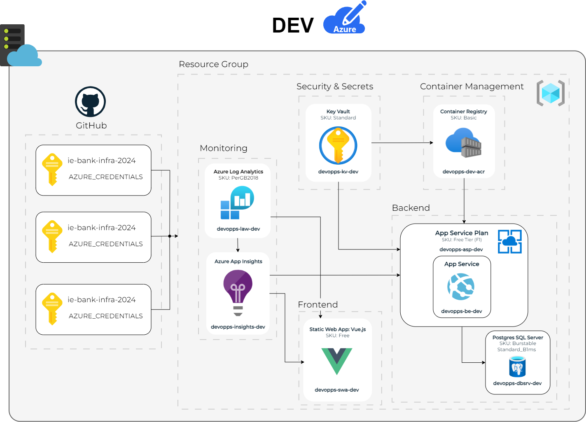

# IE Bank Corp
### By DevOpps

---

## Table of Contents
| Relevant Sections| |
|-|-|
|[Product Description](#product-description)||
|[Team Members](#team-members) ||
|[Assumptions and Constraints](#assumptions-and-constraints)||
|[Full Stack](#full-stack-development)| 4/5 |
|- [Functional Requirements](#functional-requirements)||
|--- [Admin Portal - Bank Users Management System](#admin-portal---bank-users-management-system)||
|--- [User Portal - Bank Account Management System](#user-portal---bank-account-management-system)||
|- [Non Functional Requirements](#non-functional-requirements)||
|- [Development Strategy](#development-strategy)||
|- [Frontend](#frontend)||
|- [Backend](#backend)||
|- [Testing](#testing)||
|[Infrastructure Development](#infrastructure-development)| 3/5 |
|[Cyber-Security](#cyber-security)| 4/5 |
|[Site-Reliability](#site-reliability)| 0/5 |
|[Software Modeling - Cloud Architect](#software-modeling---cloud-architect)| 3/5 |
|[Well-Architected-Framework](#well-architected-framework)||

## Product Description
The software in question is a banking system that allows users to register, create an account, and keep track of their accounts. Furthermore, implementations outside of the product itself include: unit testing for the software, GitHub flow as the branch-based flow strategy, monitoring using Azure Insights, and more.

## Team Members
- Angel Lopez
- Gloria Paraschivoiu
- Guy Mazar
- Jorge Vargas
- Pietro Rodrigano
- Ricardo Mendez
- Sebastian Perilla

## Assumptions and Constraints
### Assumptions
The necessary IaaS, SaaS, and PaaS services are provided to guarantee deployment and success. This principally refers to Azure.

The software will be continuously maintained and upgraded using the established CI/CD pipeline in this repository.

Encryption and security protocols (e.g., SSL, data encryption, two-factor authentication) will be in place to protect user data.

The system will be scalable to handle user growth without performance degradation.

The system will comply with relevant regulations (e.g., GDPR, PCI DSS) for data protection and banking operations.

Backup and disaster recovery mechanisms will prevent data loss and ensure system availability.

Third-party integrations with payment gateways or financial systems will be supported as required.

The system will maintain 24/7 availability with 99.9% uptime, leveraging Azure infrastructure.

### Constraints
The following requirements were set as constraints for a successful system deployment:

The web application must show a home page when they enter the root URL of the current website.

The web application must allow the user to add a new field into bank account data: country. The users must be able to submit the account country when they are creating a new account.

The project must have a Software Requirements Specification document.

Unit and functional tests must be used to test the backend API.

GitHub flow must be set as the branch-based workflow strategy.

Azure Application Insights must be used to enable monitoring of the application.

The project must be deployed in the User Acceptance Testing (UAT) environment.

The development costs must not exceed 3000 euros.

## Full-Stack Development
-mainly diagrams here and description of the important concepts related to the development and implementation of the front and backend that we are handling, also other relevant concepts such as the development strategy (trunk-based)-

## Functional Requirements: 

## Admin Portal - Bank Users Management System 
The IE Bank system will include a bank user's management system that can be accessed and controlled by a bank administrator. A bank users management portal will allow an admin user to view, create, update, and delete bank users.

| Requirements | Description |  
|-|-|
| FR 1. | The application must provide a default administrator account (user, password). The admin account must be able to access the users management portal once logged in successfully. |
| FR 2. | Once logged into the bank users management portal, a bank administrator can list, create, update, and delete bank users and passwords. |

### Administrator Login  
---
The system shall allow the administrator at the bank to log into the admin portal with the default administrator account that will be created once

- **`Admin Account Name`:** A unique identifier for the administrator account
- **`Admin Account Password`:** A unique password for the administrator account

### Administrator List Accounts
---
The system shall allow the administrator to list the account objects which allows the administrator to see their information with their following attributes.

- **`User Account ID`:**   A unique identifier for the account object.

The objects displayed to the administrator will be the following: 
1. ***User History***
2. ***User Balance***
3. ***User Account ID***
4. ***User Account Name***
5. ***User Account Number***
6. ***User Country***
7. ***User Balance***
8. ***User Currency***
9. ***User Status***
10. ***User Created At***

### Administrator Update Accounts
---
The system shall allow the administrator to update the all user account objects after listing the accounts with the following attributes.
 
- **`User Account Name`:** A unique name of the account holder
- **`User Account Password`:** A unique password for the user account
- **`User Country`:** The country where the user account is registered
- **`User Balance`:** The current balance of the user account
- **`User Currency`:** The currency used for the account
- **`User Status`:** The date and time when the user account was created

The objects can be updated to other values, but cannot be deleted or null within the database.

### Administrator Create Accounts
---
The system shall allow the administrator to create/register new user accounts by adding in new attributes through a frontend register page.

- **`User Account Name`:** The name of the account holder
- **`User Account Password`:** A unique password for the account holder 

A unique ***User Account ID*** will be added to the database upon successfully inputting the attributes outlined.   

### Administrator Delete Accounts
---
The system shall allow the administrator to delete user accounts on a separate page with the following attributes:

- **`User Account ID`:** A unique identifier for the account object
- **`User Account Name`:** The name of the account holder
- **`User Account Password`:** A unique password for the account holder

## User Portal - Bank Account Management System
The IE Bank system will allow multiple bank users to access the account management portal that is currently implemented. Bank users can have one or more bank accounts associated with their user profile. Bank users can use the account management portal to perform various banking operations.

| Requirements | Description |  
|-|-|
| FR 3. | New bank users can register on IE bank in the bank with a register for accessible form (username, password, password confirmation). When a new user is registered, a new account will be provided by default, with a random account number. |
| FR 4. | Bank users can log in to the web application using their username and password. Once logged in, they can view only their owned bank accounts and transactions. |
| FR 5. | Bank users can transfer money to other existing accounts in the bank from the account management portal, by entering the recipient’s account number and the amount to be transferred. Amount to transfer cannot be more than the available amount in the account. |

<!-- ---
#### Create Account Objects
---
The system shall allow users to create account objects with the following attributes:

- *Account ID:* A unique identifier for the account object.
- *Account Name:* The name of the account holder.
- *Account Number:* The account number associated with the account.
- *Country:* The country where the account is registered.
- *Balance:* The current balance of the account.
- *Currency:* The currency used for the account.
- *Status:* The status of the account (e.g., Active, Inactive).
- *Created At:* The date and time when the account was created.

The country attribute is a new field that is added to the account object. Users must be able to submit the account country when they are creating a new account. Furthermore, the system will automatically generate the account number as well as the account ID and Created At. The Status attribute will be set to Active by default.
#### Update Account Objects
---
The system shall allow users to update account objects with the following attributes:
- *Account Name:* The name of the account holder.
- *Country:* The country where the account is registered.
- *Currency:* The currency used for the account. -->

## Non Functional Requirements
For the expected MVP, the following non-functional requirements have been defined:

| Requirements | Description |  
|-|-|
| NFR 1. | The web application should implement a basic user/admin authentication system that requires the users to enter their username and password to log in. The web application should not use any advanced or complex authentication methods, such as biometric, token, or OAuth. The web application should also encrypt and store the user credentials securely (hashed) in the database. |
| NFR 2. | The web application should have a simple frontend user interface. The web application should not necessarily focus on the aesthetic aspects of the frontend, such as colors, fonts, or animations, or ensure that the frontend is compatible and responsive with different browsers and devices. |

### Development Strategy
-Trunk-Based / Feature-Based-

### Frontend
-Here we can add in some of the main design of the frontend-

### Backend
-Connecting the backend and the frontend for the database-

### Testing

### Non-Functional Requirements

#### NFR 1
#### NFR 2
#### NFR 3
#### NFR N

## Infrastructure Development

### Design and Release Strategy Overview
Our Three-Stage Deployment strategy, coupled with Trunk-Based Development, 
ensures efficient and secure code transitions through DEV, UAT, and Prod. 
In the DEV stage, rapid iterations are enabled through trunk-based development, 
where developers commit directly to the main branch for continuous integration. 
This accelerates feature development and testing using minimal resources. 
The UAT stage mirrors the production environment, 
allowing thorough validation and user acceptance testing. 
Finally, the Prod stage deploys the stable version, optimized for security, 
performance, and scalability. GitHub handles version control, while 
Azure services like Key Vault and Log Analytics ensure security and 
monitoring across all stages, ensuring reliable and smooth software delivery.

### Environment Specification

| Dev | UAT | Prod |
|-|-|-|
||  |  |

| Service            | DEV Configuration | UAT Configuration | Production Configuration |
|-------------------------|-----------------------------------------------------------------------------------------------------------------------|-|-|
| App Service Plan    | Name: `devopps-asp-dev`  SKU: Free tier (F1) Region: Same as production for consistency Scaling: Manual scaling with 1-2 instances |Name: `devopps-asp-uat`  SKU: Free tier (F1) Region: Same as production for consistency Scaling: Manual scaling with 1-2 instances|Name: `devopps-asp-prod`  SKU: Standard (B1) Region: Same as production for consistency Scaling: Manual scaling with 1-2 instances|
| App Service         | Name: `devopps-be-dev` Purpose: Host backend API (Docker containers) Runtime: Node.js/Python/DotNet | Name: `devopps-be-uat`  Purpose: Host backend API (Docker containers) Runtime: Node.js/Python/DotNet |Name: `devopps-be-prod`  Purpose: Host backend API (Docker containers) Runtime: Node.js/Python/DotNet|
| Static Web App      | Name: `devopps-swa-dev`  SKU: Free  Framework: Vue.js Purpose: Serve the frontend code |  Name: `devopps-swa-uat` SKU: Free  Framework: Vue.js Purpose: Serve the frontend code | Name: `devopps-swa-prod` SKU: Standard  Framework: Vue.js Purpose: Serve the frontend code |
| Azure Container Registry (ACR) | Name: `devopps-dev-acr`  SKU: Basic  Purpose: Store backend Docker images | Name: `devopps-dev-uat` SKU: Basic  Purpose: Store backend Docker images | Name: `devopps-dev-prod`  SKU: Standard  Purpose: Store backend Docker images |  
| PostgreSQL Server | Name: `devopps-dbsrv-dev`   Deployment: Single server Tier: Burstable Standard_B1ms  Backup: Disabled | Name: `devopps-dbsrv-uat`  Deployment: Single server Tier: Burstable Standard_B1ms  Backup: Enabled | Name: `devopps-dbsrv-prod`   Deployment: Single server Tier: Burstable Standard_B1ms   Backup: Enabled |
| Key Vault           | Name: `devopps-kv-dev`  SKU: Standard  Purpose: Store secrets and keys securely | Name: `devopps-kv-uat`  SKU: Standard  Purpose: Store secrets and keys securely | Name: `devopps-kv-prod`  SKU: Standard  Purpose: Store secrets and keys securely|
| Azure Log Analytics | Name: `devopps-law-dev`  SKU: PerGB2018  Purpose: Centralized logging | Name: `devopps-law-uat`   SKU: PerGB2018  Purpose: Centralized logging | Name: `devopps-law-prod`  SKU: PerGB2018  Purpose: Centralized logging |
| Azure Application Insights | Name: `devopps-insights-dev`  Purpose: Monitor backend and frontend telemetry metrics |Name: `devopps-insights-uat`  Purpose: Monitor backend and frontend telemetry metrics| Name: `devopps-insights-prod`  Purpose: Monitor backend and frontend telemetry metrics |

<!-- #### UAT -->
<!--  -->

<!-- 
| Service            | UAT Configuration                                                                                             |
|-------------------------|-----------------------------------------------------------------------------------------------------------------------|
| App Service Plan    | Name: `devopps-asp-uat`  SKU: Free tier (F1) Region: Same as production for consistency Scaling: Manual scaling with 1-2 instances |
| App Service         | Name: `devopps-be-uat`  Purpose: Host backend API (Docker containers) Runtime: Node.js/Python/DotNet |
| Static Web App      | Name: `devopps-swa-uat` SKU: Free  Framework: Vue.js Purpose: Serve the frontend code                          |
| Azure Container Registry (ACR) | Name: `devopps-dev-uat` SKU: Basic  Purpose: Store backend Docker images                                    |
| PostgreSQL Database | Name: `devopps-dbsrv-uat`  Deployment: Single server Tier: Burstable Standard_B1ms  Backup: Enabled              |
| Key Vault           | Name: `devopps-kv-uat`  SKU: Standard  Purpose: Store secrets and keys securely                                           |
| Azure Log Analytics | Name: `devopps-law-uat`   SKU: PerGB2018  Purpose: Centralized logging                                                      |
| Azure Application Insights | Name: `devopps-insights-uat`  Purpose: Monitor backend and frontend telemetry metrics                                    | -->

<!-- #### Production

| Service            | PROD Configuration                                                                                             |
|-------------------------|-----------------------------------------------------------------------------------------------------------------------|
| App Service Plan    | Name: `devopps-asp-prod`  SKU: Standard (B1) Region: Same as production for consistency Scaling: Manual scaling with 1-2 instances |
| App Service         | Name: `devopps-be-prod`  Purpose: Host backend API (Docker containers) Runtime: Node.js/Python/DotNet |
| Static Web App      | Name: `devopps-swa-prod` SKU: Standard  Framework: Vue.js Purpose: Serve the frontend code|
| Azure Container Registry (ACR) | Name: `devopps-dev-prod`  SKU: Standard  Purpose: Store backend Docker images|
| PostgreSQL Database | Name: `devopps-dbsrv-prod`  Deployment: Single server Tier: Burstable Standard_B1ms  Backup: Enabled |
| Key Vault           | Name: `devopps-kv-prod`  SKU: Standard  Purpose: Store secrets and keys securely |
| Azure Log Analytics | Name: `devopps-law-prod`  SKU: PerGB2018  Purpose: Centralized logging |
| Azure Application Insights | Name: `devopps-insights-prod`  Purpose: Monitor backend and frontend telemetry metrics | -->

## Cyber-Security 

### Github Hardening Strategy

-Mention the main strategies used for CyberSec here and how some of our design decisions became implemented and what measure were taken to accomplish our goals for the application-

These measures include:

|Measures| Description |
|-|-|
| *Code Scanning with CodeQL* | Security in software begins with proactive identification of vulnerabilities during development, and CodeQL plays a crucial role in achieving this. By analyzing both the frontend (Vue.js) and backend (Python) code, CodeQL enables the detection of common yet critical vulnerabilities, such as SQL injection, XSS, and command injection, before deployment. Its integration with GitHub Actions allows it to operate seamlessly within our development workflows, flagging issues as soon as code is pushed. This approach embodies "shift-left security," embedding security considerations into the earliest stages of development. With its powerful querying language and support for multiple languages, CodeQL ensures that security remains a fundamental part of the software lifecycle. |  
| *Code Scanning with OSSF Scorecard* | While CodeQL focuses on analyzing the code itself, maintaining the overall security posture of the repository requires adherence to best practices. The OSSF Scorecard complements CodeQL by evaluating key aspects of repository security, such as branch protection, two-factor authentication, and timely dependency updates. By running automated checks on a regular schedule, Scorecard ensures that our repository's security remains consistent and up to date. The detailed metrics it provides not only help identify areas for improvement but also establish a foundation for continuous compliance with open-source security standards. This is particularly critical for a financial application, where maintaining a high-security threshold is non-negotiable. |
| *GitHub Secret Scanning* | In banking applications, safeguarding sensitive information such as API keys and tokens is vital. GitHub Secret Scanning acts as a defense mechanism against the accidental leakage of these credentials. Integrated directly into GitHub, it continuously monitors for any exposed secrets, ensuring immediate detection and resolution. This proactive approach mitigates the risk of unauthorized access, protecting both the application and its sensitive financial data. By pairing Secret Scanning with CodeQL and Scorecard, we create a multi-layered security strategy that addresses not only vulnerabilities but also operational risks.|
| *Push Protection* | The integrity of the main codebase is critical in preventing accidental or malicious changes. Push Protection ensures this by blocking risky changes before they are merged. Configurations like requiring pull requests, restricting force pushes, and disallowing branch deletions provide an additional layer of control. These measures complement the outputs of CodeQL, Scorecard, and Secret Scanning by safeguarding the repository against unauthorized modifications. For a banking application, where the smallest oversight could have significant repercussions, such strict protections are indispensable. |
| *CODEOWNERS Configuration* | A robust security strategy also requires accountability, and the CODEOWNERS configuration ensures that critical changes are reviewed by the right people. By assigning each developer to their corresponding repo, we ensure that every modification undergoes special supervision. This aligns with the outputs from CodeQL, Scorecard, and Push Protection, creating a cohesive workflow where expertise and automated tools work together to secure the codebase. In a high-stakes domain like banking, this combination of automation and human oversight is key to maintaining both quality and security. |

### Secrets Management Strategy

*Overview of Secrets Management Strategy*: Managing sensitive credentials such as API keys, passwords, and other secrets is critical in securing a financial application. To achieve this, our strategy leverages Azure Key Vault for centralized credential management and Azure Managed Identities for secure, seamless access to Azure resources. The integration of Azure Bicep ensures automated and consistent deployments. This cohesive approach secures credentials for critical resources, such as the Container Registry and PostgreSQL server, while minimizing risks and simplifying workflows.

| Measures| Description |
|-|-|
| *Azure Key Vault for Credential Management* | At the heart of our strategy is Azure Key Vault, a centralized service for securely storing and managing secrets. By keeping credentials out of source control and application settings, it significantly reduces the risk of accidental exposure. Azure Key Vault’s robust encryption, compliance capabilities, and integration with other Azure services ensure that secrets are securely stored and easily retrievable by authorized applications. Its use simplifies secret management while maintaining the high level of security demanded in a banking application. By centralizing secret storage, Key Vault provides an efficient, auditable, and secure system for managing sensitive credentials.|
| *Azure Managed Identity for Secure Access* | To eliminate static credentials, we use Azure Managed Identity, which enables applications to authenticate directly with Azure resources like Key Vault. This approach ensures secure connectivity without the need for hard-coded secrets, reducing the risks associated with credential leaks. Managed Identity also automates credential rotation, providing a seamless and secure way to access resources such as the PostgreSQL server and Container Registry. This minimizes administrative overhead while maintaining a robust security posture, aligning with the compliance and operational requirements of the financial sector.|
| *Container Registry and PostgreSQL Credentials Protection* | For protecting Container Registry credentials, we rely on Azure Key Vault and Azure Bicep templates to securely store and manage admin usernames and passwords. These credentials are retrieved programmatically with strict access controls, ensuring consistent and secure practices across environments. This approach not only reduces human error but also facilitates automated credential rotation, further enhancing security. Similarly, the PostgreSQL server’s administrative credentials are stored in Azure Key Vault and accessed via Managed Identity. This ensures that sensitive secrets are never exposed in the codebase or shared manually among developers. With Bicep templates managing deployment, the workflow is automated and consistent, simplifying secret management while maintaining compliance and security.|
| *Key Rotation and Automation* | Automated key rotation is a critical aspect of our strategy, mitigating the risks associated with credential compromise over time. By leveraging Azure Key Vault’s rotation capabilities, credentials for the Container Registry and PostgreSQL server are updated automatically, adhering to security best practices. This approach reduces operational overhead and ensures that secrets are regularly refreshed, a crucial requirement in the highly regulated financial sector where compliance and frequent key updates are essential. |
| *Collaboration with the Cloud and Infrastructure Teams* | The implementation of this strategy was a collaborative effort involving the Cloud Architect, Full Stack Developer, and Infrastructure Developer. By working together, we ensured that security was embedded at every stage of development and deployment, using best practices and Azure’s robust security features.|

___

### Implemented guides in our Design Document (10)
To holistically secure our banking application, we adopted a dual framework approach, leveraging guidelines from the Open Source Security Foundation (OpenSSF) and practices from the SAFECode framework. This comprehensive strategy allowed us to address security at every level, including code, cloud infrastructure, database, and deployment. Collaborating with the Cloud Architect and development teams, we integrated 10 key security principles to minimize vulnerabilities and ensure adherence to industry best practices.

*OpenSSF Guidelines*
1. *Use a Combination of Tools in CI Pipeline to Detect Vulnerabilities:* Integrating CodeQL and OSSF Scorecard into our CI/CD pipeline allowed us to continuously analyze code for vulnerabilities. CodeQL provides semantic analysis, while Scorecard evaluates adherence to open-source best practices, offering a thorough and multi-dimensional assessment of our codebase. This dual approach ensures comprehensive vulnerability detection, reducing risks early in the development lifecycle.

    - Links: 
 https://github.com/winning-DevOps-Project/ie-bank-fe-2024/security/code-scanning
  https://github.com/winning-DevOps-Project/ie-bank-infra-2024/security/code-scanning
 https://github.com/winning-DevOps-Project/ie-bank-be-2024/security/code-scanning

2. **Implement Automated Tests, Including Negative Tests:** Automated security tests, including negative scenarios, were configured for both frontend and backend using CodeQL. These tests ensure that unintended behaviors are caught and prevented before deployment. This strategy enforces a “ship only if it passes the tests” rule, enhancing the robustness of our banking application by simulating adverse conditions.

    - Links: 
 https://github.com/winning-DevOps-Project/ie-bank-fe-2024/actions https://github.com/winning-DevOps-Project/ie-bank-infra-2024/actions https://github.com/winning-DevOps-Project/ie-bank-be-2024/actions

3. **Monitor Known Vulnerabilities in Dependencies:** Dependabot was implemented to monitor and alert us about vulnerabilities in dependencies. By identifying risks in both direct and transitive dependencies, we ensured timely updates to address potential threats. Keeping dependencies up to date reduces exposure to vulnerabilities that could arise from outdated libraries.

    - Links:
  https://github.com/winning-DevOps-Project/ie-bank-fe-2024/security/dependabot  https://github.com/winning-DevOps-Project/ie-bank-infra-2024/security/dependabot  https://github.com/winning-DevOps-Project/ie-bank-be-2024/security/dependabot

4. **Do Not Push Secrets to a Repository:** GitHub Secret Scanning was enabled to detect and block accidental inclusion of secrets in the codebase, supported by push protection to prevent sensitive information from being committed. These safeguards ensure that secrets remain out of public repositories, protecting against unauthorized access.

    - Links:
  https://github.com/winning-DevOps-Project/ie-bank-fe-2024/security/secret-scanning  https://github.com/winning-DevOps-Project/ie-bank-infra-2024/security/secret-scanning 
 https://github.com/winning-DevOps-Project/ie-bank-be-2024/security/secret-scanning

5. **Improve OpenSSF Scorecards Score** The OpenSSF Scorecard workflow was configured to evaluate our repository’s adherence to best practices such as branch protection and dependency management. By improving our Scorecard score, we continually enhance our security posture, aligning with industry standards and reinforcing our commitment to secure development.

    - Links: 
    https://github.com/winning-DevOps-Project/ie-bank-fe-2024/actions/workflows/scorecard.yml 
   https://github.com/winning-DevOps-Project/ie-bank-infra-2024/actions/workflows/scorecard.yml 
   https://github.com/winning-DevOps-Project/ie-bank-be-2024/actions/workflows/scorecard.yml

### SAFECode Framework Practices

1. **Application Security Control Definition:** 
In collaboration with the Cloud Architect, we identified and implemented Application Security Controls (ASCs) focused on authentication, data protection, and secure configurations. This ensured critical security requirements were systematically addressed, reducing risks during development.

2. **Secure Design Principles & Threat Modeling:** 
Threat modeling sessions with the Cloud Architect identified potential attack vectors and informed the design of security features. Incorporating secure design principles helped us create a resilient architecture that anticipates threats, minimizing the need for reactive fixes post-implementation.

3. **Develop an Encryption Strategy:** We used Azure Key Vault for secure storage of secrets and credentials, alongside a robust encryption strategy for data at rest and in transit. Managed Identity facilitated secure communication between services, ensuring sensitive data was consistently protected while meeting stringent financial industry standards.

    - Links: 
      https://github.com/winning-DevOps-Project/ie-bank-infra-2024/blob/main/modules/postgresql-server.bicep 
      https://github.com/winning-DevOps-Project/ie-bank-infra-2024/blob/main/modules/docker-registry.bicep

4. **Manage Security Risk Inherent in Third-Party Components** Dependabot’s alerts highlighted risks in third-party components, while our CI/CD pipeline performed automated security and compatibility testing. This proactive approach to dependency management mitigates supply chain risks and ensures the reliability of external libraries integrated into the application.
    - Links: 
     https://github.com/winning-DevOps-Project/ie-bank-fe-2024/security/dependabot  https://github.com/winning-DevOps-Project/ie-bank-infra-2024/security/dependabot 
     https://github.com/winning-DevOps-Project/ie-bank-be-2024/security/dependabot

5. **Secure Coding Practices & Code Analysis** Secure coding standards were enforced with tools like CodeQL for static analysis, ensuring developers adhered to safe functions and robust error handling practices. These measures embedded security into the development process, minimizing the likelihood of vulnerabilities being introduced during coding.
    - Links: 
     https://github.com/winning-DevOps-Project/ie-bank-fe-2024/security/code-scanning
     https://github.com/winning-DevOps-Project/ie-bank-infra-2024/security/code-scanning
     https://github.com/winning-DevOps-Project/ie-bank-be-2024/security/code-scanning

---

## Site-Reliability

-Mention the main strategies used for Site Reliability here and how some of our design decisions became implemented and what measure were taken to accomplish our goals for the application-

These measures include:

### Measure 1: 
-Add in the measure-

### Measure 2: 
-Add in the measure-

### Measure 3: 
-Add in the measure-

### Measure n: 
-Add in the measure-

## Software Modeling - Cloud Architect

### Diagrams

#### Sequence Diagram/s
<!--  -->

#### Data Flow
<!--  -->

### Entity Relationship Diagram
<!--  -->

#### 12 Factor App
<!--  -->

## Well Architected Framework

### ***Operational Excellence Pillar***

#### Deployment Strategies
- Continuous Integration and Deployment: Adopted Git feature branch strategy with CI/CD pipelines on GitHub. Protected main branch with policies and integrated deployment workflows to Development, UAT, and Production environments.
- Environment Provisioning: Provisioned environments using Bicep IaC with modularized templates for consistent deployments across Development, UAT, and Production.
#### Monitoring and Diagnostics
- Monitoring Tools: Implemented Azure Monitor and Application Insights for tracking application and infrastructure performance.
- Custom Metrics: Configured SLIs and SLOs to make sure we complie with defined SLA targets.
- Designed Azure Workbooks for log and metrics
#### Incident Management
- Integrated Azure Alerts with Slack so we get real-time incident notifications 
- Azure Automation int he use of incident recovery to minimise the downtime of our implementation
- Imade use of GitHub to record all our documentation, and workflows, and keep track of incident 
#### Continuous Improvement
- Regular retrospectives of post sprints and feedback loops to optimize our workflows. 
<!-- #### Operational Processes
- Daily backups automated and verified with Azure Backup. DO WE HAVE DAILY BACKUPS
- Policy compliance enforced with Azure Policy and monitored for drift. DO WE HAVE THIS??? to a certain extent  -->
#### Enhancing Reliability
- Reliable and scalable practices to minimize the downtime.

---

### Cost Optimization Pillar

### ***Performance Optimization in Our Architecture***

#### Efficient Resource Utilization
- Right-Sizing Resources: Continuously monitor utilisation of Azure App Service, App Service Plan, and Postgres SQL Server to ensure resource allocation aligns with workload requirements. Avoid over-provisioning by scaling compute and memory allocations based on telemetry data collected via Azure Monitor and Log Analytics.
- Auto-Scaling: For future implementation configure auto-scaling for both compute and storage resources to dynamically adjust based on demand, optimising resource allocation and ensuring performance during peak times.
- Load Balancing: For future advances implement Azure Load Balancer and Application Gateway to evenly distribute traffic across multiple instances.

#### Optimization for Scalability
- Content Delivery Network (CDN): For future introduce Azure CDN for faster content delivery to users by caching static content closer to them, reducing latency and improving overall application responsiveness.
- Microservices Architecture: For future, modularised IaC templates to define and provision independent components, such as authentication, data processing, and API services, enabling their horizontal scaling as needed.

#### Cost-Effective Performance Improvements
- Caching Mechanisms: For future, implemnt  caching strategies using Azure Cache for Redis to store frequently accessed data, reducing the need for repeated database queries and improving application performance.
- Optimized Storage Solutions: Define Azure Blob Storage configurations in IaC, specifying Hot, Cool, and Archive tiers for storage efficiency based on data access patterns.
- Efficient Data Transfer: For future, define Azure ExpressRoute configurations and bandwidth allocation in IaC for inter-region data transfer optimisation.

#### Continuous Performance Optimization
- Performance Testing: For future, use Azure Load Testing resources for simulating high user traffic and validating performance before deployment. Automate test environment provisioning via IaC to ensure consistent testing setups.

#### Enhancing System Efficiency
- Optimized Network Configuration: For future, define Azure Front Door configurations for efficient traffic routing and edge acceleration of static content. Use IaC to configure private endpoints, firewall rules, and network security groups (NSGs) for optimized backend communication.
- Sustainable Performance Practices: The current SKU choices for different environment accordingly provide a sustainable performance by utilising basic tiers for DEV and UAT to provide energy efficiency. For future, Use IaC to schedule automated shutdowns of DEV environments outside business hours to conserve resources.

### Security Pillar

## Reliability Pillar

#### 

## *Bank Users Functional Requirements*

### *Requirements Table*
| Requirements | Description |  
|--------------|-------------|
| FR 3. | New bank users can register on IE Bank in the bank with a register form (username, password, password confirmation). When a new user is registered, a new account will be provided by default, with a random account number. Users can also create additional accounts after registration. |
| FR 4. | Bank users can log in to the web application using their username and password. Once logged in, they can view only their owned bank accounts and transactions. |
| FR 5. | Bank users can transfer money to other existing accounts in the bank from the account management portal, by entering the recipient’s account number and the amount to be transferred. Amount to transfer cannot be more than the available amount in the account. |

---

### *FR 3: Register User Accounts and Create Additional Accounts*
The system shall allow a new bank user to register on the IE Bank system using a frontend registration page. The following attributes must be provided during registration:

- *User Account Name*: A unique username chosen by the user.
- *User Account Password*: A password created by the user and confirmed during registration.
- *User Country*: The country where the user resides.

Upon successful registration:
- A default account will be automatically created for the user.
- A *random account number* will be generated and associated with the new user account.

#### *Creating Additional Accounts for Existing Users*
The system shall also allow existing users to create additional accounts through the account management portal. The following attributes must be provided for additional account creation:

- *User ID*: The unique identifier of the user creating the new account (automatically linked).
- *Account Type*: The type of account being created (e.g., savings, checking).
- *Currency*: The currency for the new account (e.g., USD, EUR).
- *Initial Deposit (Optional)*: An optional amount for the initial deposit into the new account.

##### *Process for Additional Account Creation*
1. Existing users access the *Create New Account* page from their account management portal.
2. Users specify the desired *Account Type* and *Currency*.
3. The system validates the input and ensures that:
   - The user ID matches an existing user in the database.
   - The account type and currency are supported by the system.
4. A new account is created and linked to the user.

#### *Tokens Provided Upon Registration*
- *Access Token*: A JWT token for immediate access to the system.
- *Refresh Token*: A JWT token for session renewal.

#### *Validation and Error Handling*
- The system validates that the password and confirmation password match.
- Ensures that the username is not empty and is unique by querying the user database to prevent duplicate entries.
- For additional accounts, the system ensures valid input for account type and currency.

#### *Objects Created in the Database*
- *User Object*: A record is created for the user after successful validation during registration.
- *Account Object*: 
  - A default account is created during user registration.
  - Additional accounts can be created and linked to the same user.

#### *Account-User Relationships*
- Each *user* can own one or more *accounts*.
- A *user ID* serves as the primary key in the *Users table* and is used as a foreign key in the *Accounts table* to link accounts to users.
- This relationship allows querying all accounts associated with a specific user and ensures that ownership is clearly defined.

---

### *FR 4: User Login and View Accounts*
The system shall allow bank users to log into the IE Bank system using the following attributes provided on a frontend login page:

- *User Account Name*: The unique username created during registration.
- *User Account Password*: The password associated with the account.

Upon successful login:
- A *JWT Access Token* is issued for session authentication.
- A *JWT Refresh Token* is provided for session renewal.

#### *User Account and Transaction Viewing*
- ***Account Ownership***: Bank users can only view their own accounts and associated transaction history through authenticated routes.
- *Administrator Privileges*: Administrators have access to view all accounts and transactions within the system.

---

### *FR 5: Transfer Funds Between Accounts*
The system shall allow bank users to transfer funds to other accounts within the IE Bank system via the account management portal. The following attributes must be provided:

- *Sender Account Number*: The account number of the user initiating the transfer.
- *Recipient Account Number*: The account number of the recipient.
- *Transfer Amount*: The amount of money to be transferred.

#### *Transfer Validation*
- *Amount Validation*: The transfer amount must be greater than zero.
- *Balance Verification*: The system checks that the sender's balance is sufficient to complete the transfer. Transfers exceeding the available balance are denied.

#### *Transaction Process*
1. *Account Balances Update*:
   - The sender's account balance is reduced by the transfer amount.
   - The recipient's account balance is increased by the same amount.
2. *Transaction Record*:
   - A *Transaction Object* is created to record the transaction details, including the sender, recipient, and transfer amount.
