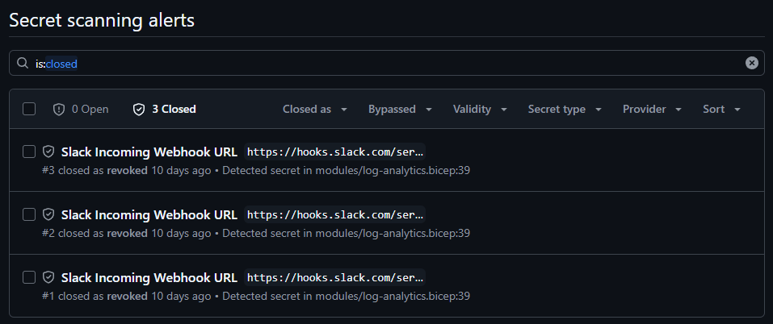

# IE Bank Corp
### By DevOpps

---

## Table of Contents

| Roles | Relevant Subsections |
|-|-|
|[Product Owner](#product-owner)| [- Product planning](#product-planning)   - [Scrum Methodology](#scrum-methodology)   - [DevOps Collaboration](#devops-collaboration)|
|[Team Members](#team-members) ||
|[Full Stack](#full-stack-development)| - [Continuous Integration](#continious-integration)   - [Test Driven Development](#test-driven-development)   - [Continious Deployment](#continious-deployment) |
|[Infrastructure Development](#infrastructure-development)| - [IaC Code](#infrastructure-as-code---modularization-strategy)   - [Hosting Infrastructure](#hosting-infrastructure---environment-specification)   - [Continuous Integration/Continious Deployment](#infrastructure-release-strategy)|
|[Cyber-Security](#cyber-security)| -  [Github Hardening Strategy](#github-hardening-strategy-for-banking-application)   - [Secrets Management](#secrets-management-strategy)   -  [Implemented guides](#10-implemented-guides-in-our-design-document)  |
|[Site-Reliability](#site-reliability)| [Monitoring Strategy](#monitoring-strategy)   - [Incident Response](#incident-management)   - [Reliability Design](#reliability-design) |
|[Software Modeling - Cloud Architect](#software-modeling---cloud-architect)| - [Well Architected Framework](#well-architected-framework)   - [Sofware Modeling](#software-modeling---cloud-architect)  |

<!--|[Assumptions and Constraints](#assumptions-and-constraints)|| -->
<!--|- [Functional Requirements](#functional-requirements)||
|--- [Admin Portal - Bank Users Management System](#admin-portal---bank-users-management-system)||
|--- [User Portal - Bank Account Management System](#user-portal---bank-account-management-system)||
|- [Non Functional Requirements](#non-functional-requirements)||
|- [Development Strategy](#development-strategy)||
|- [Frontend](#frontend)||
|- [Backend](#backend)||
|- [Testing](#testing)|| -->

## Product Description
The software in question is a banking system that allows users to register, create an account, and keep track of their accounts. Furthermore, implementations outside of the product itself include: unit testing for the software, GitHub flow as the branch-based flow strategy, monitoring using Azure Insights, and more.

## Team Members
- Angel Lopez (Product Owner)
- Gloria Paraschivoiu (Full Stack)
- Guy Mazar (Site Reliability Engineer)
- Jorge Vargas (Cybersecurity Expert)
- Pietro Rodrigano (Full Stack)
- Ricardo Mendez (Infrastructure)
- Sebastian Perilla (Cloud Architect)
- Anna Shats (Infrastructure)

## Assumptions and Constraints
### Assumptions
<!-- The necessary IaaS, SaaS, and PaaS services are provided to guarantee deployment and success. This principally refers to Azure.

The software will be continuously maintained and upgraded using the established CI/CD pipeline in this repository.

Encryption and security protocols (e.g., SSL, data encryption, two-factor authentication) will be in place to protect user data.

The system will be scalable to handle user growth without performance degradation.

The system will comply with relevant regulations (e.g., GDPR, PCI DSS) for data protection and banking operations.

Backup and disaster recovery mechanisms will prevent data loss and ensure system availability.

Third-party integrations with payment gateways or financial systems will be supported as required.

The system will maintain 24/7 availability with 99.9% uptime, leveraging Azure infrastructure.

### Constraints
The following requirements were set as constraints for a successful system deployment:

The web application must show a home page when they enter the root URL of the current website.

The web application must allow the user to add a new field into bank account data: country. The users must be able to submit the account country when they are creating a new account.

The project must have a Software Requirements Specification document.

Unit and functional tests must be used to test the backend API.

GitHub flow must be set as the branch-based workflow strategy.

Azure Application Insights must be used to enable monitoring of the application.

The project must be deployed in the User Acceptance Testing (UAT) environment.

The development costs must not exceed 3000 euros. -->
## Product Owner

### Product Planning
Product vision: Provide a secure, intuitive, and efficient digital banking solution for managing accounts, transactions, and personal finances, prioritizing user convenience and operational transparency.

Product mision: Empower users with a robust, easy-to-use platform for banking services, ensuring data security, financial accessibility, and a seamless user experience to build trust and foster long-term customer relationships.

Product vision board.

Minimum Viable Product(MVP):
->Admin Portal:

  -Default admin credentials.

  -CRUD functionalities for user management (view, create, update, delete users).

->User Portal:

  -Registration for new users (default account assigned).

  -Login functionality.
  
  -Ability to view owned accounts and transactions.
  
  -Transfer money to existing accounts with validation.

->Basic Authentication System:

  -User credentials securely hashed.

->Simple Frontend Interface:

  -Functional and minimalistic design.

Requirements:

->Functional Requirements:

  -Default admin account creation.
  
  -Admin portal for user management.
  
  -User registration, login, and account management.
  
  -Transaction functionalities (view, transfer).

->Non-Functional Requirements:

  -Secure storage for user credentials.
  
  -Minimalistic and responsive user interface.

Objectives and OKRs:

Objective 1: Deliver a functional MVP within the next quarter.

Key Results:

  -Admin portal completed and tested
  
  -User registration and login functionalities deployed 
  
  -Transaction features functional and deployed 
  
  -Basic UI design finalized and integrated

Objective 2: Ensure platform security and reliability.

Key Results:

  -Implement secure credential storage by week 3.
  
  -Test authentication systems with 100% success rate by week 6.
  
  -Achieve uptime of 99.9% during MVP testing phase.
  
  -Conduct three rounds of vulnerability assessments.

Objective 3: Optimize development and collaboration processes.

Key Results:

  -Conduct daily stand-ups with at least 90% participation.
  
  -Reduce sprint backlog overflow to under 5% per sprint.
  
  -Achieve a 10% reduction in deployment issues.
  
  -Document all processes in GitHub pages.

Objective 4: Enhance user experience.

Key Results:

  -Achieve user feedback score of 4.5/5 for UI design.
  
  -Reduce user flow navigation issues by 20% 
  
  -Complete UX testing 

Objective 5: Foster a collaborative team environment.

Key Results:

  -Conduct a minimum of three sprint reviews with actionable feedback.
  
  -Organize at least two retrospective meetings to refine team practices.
  
  -Train team members on new tools and integrations.
 
### Scrum Methodology
1. Scrum Ceremonies
- Backlog Grooming:
  Collaborate with team members to refine and prioritize the backlog.
  Break down epics into actionable user stories with clear acceptance criteria.
  Schedule weekly grooming sessions to ensure backlog readiness.

- Sprint Planning
  Define sprint goals based on the MVP requirements and project roadmap.
  Select user stories from the product backlog to include in the sprint backlog.
  Ensure all stories are well-documented and feasible for the sprint duration.
  Use Azure DevOps Boards to track and document the sprint backlog.

- Daily Stand-ups
  Conduct 15-minute stand-ups weekly.
  Team members share:
  What they accomplished since the last meeting.
  What they plan to do next.
  Any blockers impeding their progress.
  Record and track stand-ups using Zoom or Slack integrations.

- Sprint Review
  Present completed functionalities to stakeholders.
  Showcase the MVP features using a live demo (e.g., UAT environment).
  Gather feedback to update the product backlog.

- Sprint Retrospective
  Discuss:
  What went well during the sprint.
  Areas of improvement.
  Acknowledgments for team contributions.
  Use Azure DevOps Team Retrospective tools to document the outcomes.

2. Roles and Responsibilities

Product Owner
- Define the product vision and roadmap.
- Prioritize and manage the product backlog.
- Communicate project goals and updates to stakeholders.
- Ensure stories are well-defined with clear acceptance criteria.

Scrum Team
- Cross-functional team responsible for delivering the sprint goals.
- Includes developers, DevOps engineers, and cybersecurity specialists.

Scrum Master
- Facilitate Scrum ceremonies and remove blockers for the team.
- Ensure adherence to Scrum principles and methodologies.

3. Tools and Integrations
Azure DevOps Boards
- Use for backlog and sprint planning.
- Document epics, features, and user stories.
GitHub
- Use for version control and integration with CI/CD pipelines.
Slack
- Integrate with Azure Boards for real-time collaboration and updates.
- Connect with GitHub for notifications on pull requests and builds.
Zoom
- Record stand-ups, sprint planning, and reviews for documentation purposes.

4. Sprint Workflow
Pre-Sprint:
- Conduct backlog grooming and sprint planning.
- Ensure acceptance criteria for all stories are documented.
- Prepare GitHub and Azure DevOps integrations.
During Sprint:
- Host weekly stand-ups.
- Track progress on Azure DevOps Boards.
- Resolve blockers quickly in collaboration with team members.
Post-Sprint:
- Conduct sprint review and retrospective.
- Update backlog based on feedback and lessons learned.
- Plan the next sprint.

### DevOps Collaboration

-We connected Slack with Github to have notifications on slack about our progress on the 
 advancement in github.

-Slack was connnected also to Azure Devops, through some extensions of slack.

-The connection of Slaack-Zoom was not working, so we used normal zoom, whatsapp and slack calls 
 to have meetings online.

-We connected Azure-alerts with slack, through slack webhooks.

-The conexion github-azure devops, was not completed due to problems with azure devops, when we tryed to connect it, it appears a message saying that we arent part of a group that has the persmissions, but wevery member of devOpps is inside that group.

## Full-Stack Development
-mainly diagrams here and description of the important concepts related to the development and implementation of the front and backend that we are handling, also other relevant concepts such as the development strategy (trunk-based)-

## Functional Requirements: 

## Admin Portal - Bank Users Management System 
The IE Bank system will include a bank user's management system that can be accessed and controlled by a bank administrator. A bank users management portal will allow an admin user to view, create, update, and delete bank users.

| Requirements | Description |  
|-|-|
| FR 1. | The application must provide a default administrator account (user, password). The admin account must be able to access the users management portal once logged in successfully. |
| FR 2. | Once logged into the bank users management portal, a bank administrator can list, create, update, and delete bank users and passwords. |

### Administrator Login  
---
The system shall allow the administrator at the bank to log into the admin portal with the default administrator account that will be created once

- **`Admin Account Name`:** A unique identifier for the administrator account
- **`Admin Account Password`:** A unique password for the administrator account

### Administrator List Accounts
---
The system shall allow the administrator to list the account objects which allows the administrator to see their information with their following attributes.

- **`User Account ID`:**   A unique identifier for the account object.

The objects displayed to the administrator will be the following: 
1. ***User History***
2. ***User Balance***
3. ***User Account ID***
4. ***User Account Name***
5. ***User Account Number***
6. ***User Country***
7. ***User Balance***
8. ***User Currency***
9. ***User Status***
10. ***User Created At***

### Administrator Update Accounts
---
The system shall allow the administrator to update the all user account objects after listing the accounts with the following attributes.
 
- **`User Account Name`:** A unique name of the account holder
- **`User Account Password`:** A unique password for the user account
- **`User Country`:** The country where the user account is registered
- **`User Balance`:** The current balance of the user account
- **`User Currency`:** The currency used for the account
- **`User Status`:** The date and time when the user account was created

The objects can be updated to other values, but cannot be deleted or null within the database.

### Administrator Create Accounts
---
The system shall allow the administrator to create/register new user accounts by adding in new attributes through a frontend register page.

- **`User Account Name`:** The name of the account holder
- **`User Account Password`:** A unique password for the account holder 

A unique ***User Account ID*** will be added to the database upon successfully inputting the attributes outlined.   

### Administrator Delete Accounts
---
The system shall allow the administrator to delete user accounts on a separate page with the following attributes:

- **`User Account ID`:** A unique identifier for the account object
- **`User Account Name`:** The name of the account holder
- **`User Account Password`:** A unique password for the account holder

## User Portal - Bank Account Management System
The IE Bank system will allow multiple bank users to access the account management portal that is currently implemented. Bank users can have one or more bank accounts associated with their user profile. Bank users can use the account management portal to perform various banking operations.

| Requirements | Description |  
|-|-|
| FR 3. | New bank users can register on IE bank in the bank with a register for accessible form (username, password, password confirmation). When a new user is registered, a new account will be provided by default, with a random account number. |
| FR 4. | Bank users can log in to the web application using their username and password. Once logged in, they can view only their owned bank accounts and transactions. |
| FR 5. | Bank users can transfer money to other existing accounts in the bank from the account management portal, by entering the recipient’s account number and the amount to be transferred. Amount to transfer cannot be more than the available amount in the account. |

---

PIETROS PART
PIETROS PART
PIETROS PART
PIETROS PART
PIETROS PART
PIETROS PART
PIETROS PART
PIETROS PART
PIETROS PART
PIETROS PART
PIETROS PART

---
<!-- ---
#### Create Account Objects
---
The system shall allow users to create account objects with the following attributes:

- *Account ID:* A unique identifier for the account object.
- *Account Name:* The name of the account holder.
- *Account Number:* The account number associated with the account.
- *Country:* The country where the account is registered.
- *Balance:* The current balance of the account.
- *Currency:* The currency used for the account.
- *Status:* The status of the account (e.g., Active, Inactive).
- *Created At:* The date and time when the account was created.

The country attribute is a new field that is added to the account object. Users must be able to submit the account country when they are creating a new account. Furthermore, the system will automatically generate the account number as well as the account ID and Created At. The Status attribute will be set to Active by default.
#### Update Account Objects
---
The system shall allow users to update account objects with the following attributes:
- *Account Name:* The name of the account holder.
- *Country:* The country where the account is registered.
- *Currency:* The currency used for the account. -->

## Non Functional Requirements
For the expected MVP, the following non-functional requirements have been defined:

| Requirements | Description |  
|-|-|
| NFR 1. | The web application should implement a basic user/admin authentication system that requires the users to enter their username and password to log in. The web application should not use any advanced or complex authentication methods, such as biometrics, token, or OAuth. The web application should also encrypt and store the user credentials securely (hashed) in the database. |
| NFR 2. | The web application should have a simple frontend user interface. The web application should not necessarily focus on the aesthetic aspects of the frontend, such as colors, fonts, or animations, or ensure that the frontend is compatible and responsive with different browsers and devices. |

### FRONTEND -- CI STRATEGY
### GitHub Branch Protection Rules

### Main Branch
- Must use **Pull Requests** before merging.
- Requires at least **one code review approval**.
- All **status checks** from CI pipelines must pass prior to merging
---

## Team Collaboration

### Feature Branches
- Use **feature branches** with nomenclature: `feature/<feature-name>`.
- **Short-lived feature branches** are used for bug fixes and feature development/updates.
- Regular **communication among team members** to prevent merge conflicts and maintain a smooth process.

### Trunk-Based Development
- All feature branches are merged back into the `main` branch promptly to avoid divergence.
- Frequent integration is encouraged to catch issues early.

---

## Build Jobs Overview

### Frontend CI Workflow

#### Key Steps:
1. **Code Checkout**: Utilize `actions/checkout@v4`.
2. **Node.js Setup**: Use `actions/setup-node@v4`.
3. **Dependency Installation and Build**:
   - Install dependencies via `npm install`.
   - Build the application for environments:
     - `build-dev`: Development.
     - `build-uat`: User Acceptance Testing.
     - `build-prod`: Production.
4. **Artifact Upload**:
   - Use `actions/upload-artifact@v4` to store build artifacts for deployment.

#### Trigger Events:
- **Pushes** to feature branches deploy to the **development environment**.
- **Pull Requests** to `main` trigger **UAT deployment**.
- **Pushes** to `main` deploy to **production**.

---

### Frontend
-Here we can add in some of the main designs of the front-

### Backend
-Connecting the backend and the frontend for the database-

# Backend CI Workflow

#### Key Steps:
1. **Checkout Code**: Use `actions/checkout@v4`.
2. **Setup Python**: Leverage `actions/setup-python@v5`.
3. **Dependency Management**:
   - Install required packages using `pip`.
4. **Testing**:
   - Execute **functional** and **unit tests**.
5. **Save Docker Context**:
   - Store Docker context as an artifact using `actions/upload-artifact@v4`.

#### Trigger Events:
- On **manual dispatch** via workflow triggers.
- On **pull requests** to the `main` branch.
- On **pushes** to any other branch.

---

### Deployment Environments

1. **Development (DEV)**:
   - Triggered by **feature branch pushes**.
   - Hosted in Azure DEV resource group.
2. **User Acceptance Testing (UAT)**:
   - Triggered by **pull requests** to `main`.
   - Validates features in the staging environment.
3. **Production (PROD)**:
   - Triggered by **successful merges** to `main`.
   - Stable release for end-users.

---

## Automation Highlights

### Frontend
- YAML workflow ensures a **seamless build and deployment pipeline**.
- Environment-specific build steps ensure compatibility and readiness for production.

### Backend
- Automated **testing and containerization** for consistent application deployment.
- Workflow integrates Docker for seamless production deployments.

---
### Additional Notes
- **Code Reviews**: Promote teamwork and ensure subgroups are aware of peers' contributions and issues faced.
- **Testing Philosophy**: Aligns with TDD principles, integrating **unit** and **functional tests**.
- **Communication Channels**: Mainly updates via **Slack integration**.
---

### Test Driven Development (TDD)

## Test-Driven Development (TDD)

### TDD Workflow
TDD is a repeated process where we write failing tests, write code that ensures the test passes, and refactor.

### Testing & Implementation Details
- **Unit Tests**:
  - Developed using **Pytest**, which verifies components of the implementation.
- **Functional Tests**:
  - This was done using **Postman**, with **Postbot**, to verifiy the end-to-end scenarios in the **User Acceptance Testing (UAT)** environment. This includes the overall management of a bank accpunt, the respective transactions, as well as the user's authorised login.

---

### Workflow Integration
- Functional tests are integrated into the **build and deployment workflows**.
- **GitHub Status Checks** ensure:
  - Only **pull requests** that pass all the tests can continue, and be successfully merged into `main`

---

### Benefits
This integration ensures **high-quality code** throughout the development lifecycle, from development to deployment.

---
## Continuous Deployment (CD) Strategy

### Frontend CD Workflow

#### Key Steps:
1. **Artifact Retrieval**:
   - Retrieve build artifacts from the CI pipeline using `actions/download-artifact@v4`.
2. **Static Web Deployment**:
   - Deploy the application to **Azure Static Web Apps** for efficient and scalable hosting.
3. **Environment-Specific Deployments**:
   - **Development (DEV)**: Automatically deploy builds from feature branches.
   - **User Acceptance Testing (UAT)**: Deploy builds from pull requests to `main`.
   - **Production (PROD)**: Deploy finalized builds after successful merges to `main`.

#### Deployment Automation:
- **YAML Configuration**: Automates deployment steps for different environments.
- **Validation**:
  - Ensure UAT deployment succeeds before allowing production releases.

---

### Backend CD Workflow

#### Key Steps:
1. **Artifact Retrieval**:
   - Fetch Docker images stored as artifacts from CI pipelines.
2. **Dockerization**:
   - Deploy the backend as a containerized application to **Azure App Service**.
3. **Secrets Management**:
   - Use **Azure Key Vault** to securely manage database credentials and other sensitive data.
4. **Environment-Specific Deployments**:
   - **Development (DEV)**: Triggered by feature branch pushes.
   - **User Acceptance Testing (UAT)**: Triggered by pull requests to `main`.
   - **Production (PROD)**: Triggered by successful merges to `main`.

#### Deployment Automation:
- **Docker Workflow**:
  - Build and push Docker images to **Azure Container Registry**.
  - Deploy containers to **App Service** instances for each environment.
- **Validation**:
  - Functional tests to make sure deployments are stable and meet acceptance criteria 
---

### Continuous Deployment Highlights
- **End-to-End Validation**:
  - Functional tests in UAT environments ensure production readiness.
- **Monitoring**:
  - Post-deployment, application health is monitored using **Azure Application Insights**.

---

### Release Strategy

### Overview
The release strategy is designed to ensure **high-quality deployments** across all environments—**Development (DEV)**, **User Acceptance Testing (UAT)**, and **Production (PROD)**. This can inclue workflows, various types of robust testing, and validation steps to streamline the release process.

---

### Environment-Specific Strategy

#### 1. **Development (DEV)**
- **Purpose**: Experimental environment for active development and testing.
- **Triggers**:
  - Pushes to **feature branches**.
- **Deployment Steps**:
  - Build artifacts generated in CI are deployed automatically.
  - Functional tests run to validate components
- **Outcome**:
  - Quick feedback for developers to iterate on features and fixes.

#### 2. **User Acceptance Testing (UAT)**
- **Purpose**: Staging environment for stakeholder validation and functional testing.
- **Triggers**:
  - Pull requests to the `main` branch.
- **Deployment Steps**:
  - Deployment to UAT occurs automatically after CI pipelines pass.
  - Functional and integration tests validate end-to-end scenarios.
- **Outcome**:
  - Confirms that features meet requirements and are production-ready.

#### 3. **Production (PROD)**
- **Purpose**: Stable environment for end-user access.
- **Triggers**:
  - Successful merges to the `main` branch.
- **Deployment Steps**:
  - Artifacts validated in UAT are deployed to production.
  - Monitoring tools, such as **Azure Application Insights**, ensure stability.
- **Outcome**:
  - Features are procided to the end-users.
---

### Key Components

#### Validation Gates
- **GitHub Status Checks**:
  - CI and CD pipelines must pass all automated tests before deployment to UAT or PROD.
- **Manual Approvals**:
  - Optional approvals can be required for critical production releases.

#### Rollback Mechanism
- Each deployment is tagged, enabling easy rollback in case of failures.
- **Dockerized backend** and **static frontend** make reverting to previous builds straightforward.

#### Monitoring and Feedback
- Use **Azure Monitor** and **Application Insights** for real-time tracking.
- Alerts configured to notify teams of any critical issues post-release.

#### Communication
- **Release Notes**:
  - Document changes, new features, and fixes for each release.
- **Slack Notifications**:
  - Notify stakeholders and developers about deployments and their outcomes.

---

### Benefits
- **Consistency**: Automating builds and deployments reduces human error.
- **Scalability**: Environment-specific configurations support growing user bases and features.
- **Transparency**: Stakeholders can validate features in UAT before they go live.
- **Resilience**: Robust rollback and monitoring mechanisms ensure stability in production.

This release strategy aligns with the **CI/CD pipeline**, enabling seamless, automated, and reliable delivery of software updates across all stages of development and deployment.

---
## Infrastructure Development

### Design and Release Strategy Overview
Our three-stage deployment strategy and trunk-based development
ensure efficient and secure code transitions through DEV, UAT, and production. 
In the DEV stage, rapid iterations are enabled through trunk-based development, 
where developers commit directly to the main branch for continuous integration. 
This accelerates feature development and testing using minimal resources. 
The UAT stage mirrors the production environment, 
allowing thorough validation and user acceptance testing. 
Finally, the Prod stage deploys the stable version, optimized for security, 
performance, and scalability. GitHub handles version control, while 
Azure services like Key Vault and Log Analytics ensure security and 
monitoring across all stages, ensuring reliable and smooth software delivery.

### ⁠Infrastructure as Code - Modularization Strategy

#### CI/CD and DevOps Alignment
- Our modularisation strategy integrates seamlessly with a Continuous Integration/Continuous Deployment pipeline, enabling frequent, automated code deployments across all environments.
- By leveraging Container Registry for storing Docker images, Azure DevOps Pipelines or other CI/CD tools can automate builds, tests, and deployments.
-Each module is represented as a reusable Bicep module allowing version control of infrastructure through Github and automated validation in the workflows to ensure they are syntactically correct and free of configuration errors. Additionally, testing of IaC changes before applying them to higher environments and simplified rollbacks and updates with minimal downtime.

#### Scalability: Independent Scaling of Modules
- Modularized components such as Static Web Apps, Azure App Service, and Postgres SQL Server are independently deployed and managed using. Bicep templates, allowing seamless scaling based on workload demands.
- Azure App Service Plan enables horizontal or vertical scaling of backend services without impacting other layers, such as frontend static apps or monitoring systems.
- Container Registry ensures scalable deployment of containerized workloads, allowing new instances to spin up dynamically in response to traffic spikes.
-For databases, Postgres SQL can scale vertically (adding CPU or memory) or horizontally (partitioning data) to meet demand. For future improvements, we will integrate replicas with load balancers like Azure Application Gateway to route queries appropriately and so handle increasing workloads.

#### Security
- Key Vault serves as a centralised and secure repository for managing sensitive credentials, API keys, and certificates. Environment-specific secrets, such as database connection strings or API tokens, are separated for environments. This allows for updates to secrets and key rotations to be managed centrally and be propagated to the respective modules, ensuring consistent security practices.
- Security settings like firewall rules and private endpoints for Postgres SQL Server are managed through Bicep templates, restricting access to trusted networks and services to ensure a robust and scalable security structure.

#### Flexibility: Modular Design for Independent Updates
- The architecture’s modular nature means individual components can be updated or replaced without requiring downtime for the entire system or need of major changes to the rest of the architecture. As well as ease of modificatiins to the system, the probability or error prone changes decreases due to the isolated nature where each module is independently defined, tested, and validated, ensuring that changes made to one component do not inadvertently affect others.
- The architecture is tightly integrated with CI/CD pipelines, ensuring that any updates to a specific module are automatically validated through rigorous testing before deployment. These tests include syntax validation, integration tests, and environment-specific functional testing.

### Hosting Infrastructure - Environment Specification

| Dev | UAT | Prod |
|-|-|-|
||  |  |

| Service            | DEV Configuration | UAT Configuration | Production Configuration |
|-------------------------|-----------------------------------------------------------------------------------------------------------------------|-|-|
| App Service Plan    | Name: `devopps-asp-dev`  SKU: Free tier (F1) Region: Same as production for consistency Scaling: Manual scaling with 1-2 instances |Name: `devopps-asp-uat`  SKU: Free tier (F1) Region: Same as production for consistency Scaling: Manual scaling with 1-2 instances|Name: `devopps-asp-prod`  SKU: Standard (B1) Region: Same as production for consistency Scaling: Manual scaling with 1-2 instances|
| App Service         | Name: `devopps-be-dev` Purpose: Host backend API (Docker containers) Runtime: Node.js/Python/DotNet | Name: `devopps-be-uat`  Purpose: Host backend API (Docker containers) Runtime: Node.js/Python/DotNet |Name: `devopps-be-prod`  Purpose: Host backend API (Docker containers) Runtime: Node.js/Python/DotNet|
| Static Web App      | Name: `devopps-swa-dev`  SKU: Free  Framework: Vue.js Purpose: Serve the frontend code |  Name: `devopps-swa-uat` SKU: Free  Framework: Vue.js Purpose: Serve the frontend code | Name: `devopps-swa-prod` SKU: Standard  Framework: Vue.js Purpose: Serve the frontend code |
| Azure Container Registry (ACR) | Name: `devopps-dev-acr`  SKU: Basic  Purpose: Store backend Docker images | Name: `devopps-dev-uat` SKU: Basic  Purpose: Store backend Docker images | Name: `devopps-dev-prod`  SKU: Standard  Purpose: Store backend Docker images |  
| PostgreSQL Server | Name: `devopps-dbsrv-dev`   Deployment: Single server Tier: Burstable Standard_B1ms  Backup: Disabled | Name: `devopps-dbsrv-uat`  Deployment: Single server Tier: Burstable Standard_B1ms  Backup: Enabled | Name: `devopps-dbsrv-prod`   Deployment: Single server Tier: Burstable Standard_B1ms   Backup: Enabled |
| Key Vault           | Name: `devopps-kv-dev`  SKU: Standard  Purpose: Store secrets and keys securely | Name: `devopps-kv-uat`  SKU: Standard  Purpose: Store secrets and keys securely | Name: `devopps-kv-prod`  SKU: Standard  Purpose: Store secrets and keys securely|
| Azure Log Analytics | Name: `devopps-law-dev`  SKU: PerGB2018  Purpose: Centralized logging | Name: `devopps-law-uat`   SKU: PerGB2018  Purpose: Centralized logging | Name: `devopps-law-prod`  SKU: PerGB2018  Purpose: Centralized logging |
| Azure Application Insights | Name: `devopps-insights-dev`  Purpose: Monitor backend and frontend telemetry metrics |Name: `devopps-insights-uat`  Purpose: Monitor backend and frontend telemetry metrics| Name: `devopps-insights-prod`  Purpose: Monitor backend and frontend telemetry metrics |

<!-- #### UAT -->
<!--  -->

<!-- 
| Service            | UAT Configuration                                                                                             |
|-------------------------|-----------------------------------------------------------------------------------------------------------------------|
| App Service Plan    | Name: `devopps-asp-uat`  SKU: Free tier (F1) Region: Same as production for consistency Scaling: Manual scaling with 1-2 instances |
| App Service         | Name: `devopps-be-uat`  Purpose: Host backend API (Docker containers) Runtime: Node.js/Python/DotNet |
| Static Web App      | Name: `devopps-swa-uat` SKU: Standard Framework: Vue.js Purpose: Serve the frontend code                          |
| Azure Container Registry (ACR) | Name: `devopps-dev-uat` SKU: Basic  Purpose: Store backend Docker images                                    |
| PostgreSQL Database | Name: `devopps-dbsrv-uat`  Deployment: Single server Tier: Burstable Standard_B1ms  Backup: Enabled              |
| Key Vault           | Name: `devopps-kv-uat`  SKU: Standard  Purpose: Store secrets and keys securely                                           |
| Azure Log Analytics | Name: `devopps-law-uat`   SKU: PerGB2018  Purpose: Centralized logging                                                      |
| Azure Application Insights | Name: `devopps-insights-uat`  Purpose: Monitor backend and frontend telemetry metrics                                    | -->

<!-- #### Production

| Service            | PROD Configuration                                                                                             |
|-------------------------|-----------------------------------------------------------------------------------------------------------------------|
| App Service Plan    | Name: `devopps-asp-prod`  SKU: Standard (B1) Region: Same as production for consistency Scaling: Manual scaling with 1-2 instances |
| App Service         | Name: `devopps-be-prod`  Purpose: Host backend API (Docker containers) Runtime: Node.js/Python/DotNet |
| Static Web App      | Name: `devopps-swa-prod` SKU: Standard  Framework: Vue.js Purpose: Serve the frontend code|
| Azure Container Registry (ACR) | Name: `devopps-dev-prod`  SKU: Standard  Purpose: Store backend Docker images|
| PostgreSQL Database | Name: `devopps-dbsrv-prod`  Deployment: Single server Tier: Burstable Standard_B1ms  Backup: Enabled |
| Key Vault           | Name: `devopps-kv-prod`  SKU: Standard  Purpose: Store secrets and keys securely |
| Azure Log Analytics | Name: `devopps-law-prod`  SKU: PerGB2018  Purpose: Centralized logging |
| Azure Application Insights | Name: `devopps-insights-prod`  Purpose: Monitor backend and frontend telemetry metrics | -->

### Infrastructure Release Strategy

Our release strategy for the DevOpps Bank Infrastructure is designed to ensure seamless, automated, and secure deployment across multiple environments (Development, UAT, and Production). The following aspects describe our release strategy:

#### Infrastructure as Code (IaC)
The infrastructure is defined and managed using Bicep templates, ensuring consistent deployments and easy scalability.
The main.bicep file orchestrates the deployment of resources, while modular templates located in the modules directory encapsulate reusable configurations for components such as the Key Vault, Azure Container Registry, Database Infrastructure, etc.

#### CI/CD Pipeline
Deployment workflows are automated using GitHub Actions enabling continuous integration and delivery of infrastructure changes. In particular, a workflow called "ie-bank-infra.yml" is ran upon different actions. When pushing to any branch, the build and deploy to development jobs are ran, while deployment to UAT is only done upon a pull request. Finally, deployment to Production is done after a pull request is merged successfully, following all the requirements imposed to do so, like a code review, passing the necessary tests, etc.

#### Environment-Specific Configurations
Parameter files located in the parameters directory allow environment-specific customizations for Development, UAT, and Production environments.
This separation ensures that deployments are tailored to the specific requirements of each environment without modifying the core infrastructure templates.

This means that we can scale our environments endlessly by just creating different parameter files with new conditions for new deployment settings.

#### Testing and Validation
The CI/CD pipeline created involves unit testing as well as linting. The workflow has a linting step integrated, which is used to guarantee that the main.bicep file is correctly structured. Also, a separate "kv-test.yml" is executed upon the actions previously mentioned, going through a dry run of the Key Vault deployment to ensure everything is working correctly.

It is also important to highlight that the deployment steps (Development and UAT) also serve as tests before deploying to production.

# Cyber Security

## GitHub Hardening Strategy for Banking Application

### Code Scanning with CodeQL

Security in software begins with proactive identification of vulnerabilities during development, and CodeQL plays a crucial role in achieving this. By analyzing both the frontend (Vue.js) and backend (Python) code, CodeQL enables the detection of common yet critical vulnerabilities, such as SQL injection, XSS, and command injection, before deployment. Its integration with GitHub Actions allows it to operate seamlessly within our development workflows, flagging issues as soon as code is pushed. This approach embodies "shift-left security," embedding security considerations into the earliest stages of development. With its powerful querying language and support for multiple languages, CodeQL ensures that security remains a fundamental part of the software lifecycle.

#### Key Vulnerabilities Detected
- SQL Injection
- Cross-Site Scripting (XSS)
- Command Injection

| Tool   | Purpose                    | Key Benefits                 |
|--------|----------------------------|------------------------------|
| CodeQL | Detect code vulnerabilities | Proactive, detailed analysis |

*Screenshot:* Below is an example screenshot of CodeQL scanning results:

### Code Scanning with OSSF Scorecard

While CodeQL focuses on analyzing the code itself, maintaining the overall security posture of the repository requires adherence to best practices. The OSSF Scorecard complements CodeQL by evaluating key aspects of repository security, such as branch protection, two-factor authentication, and timely dependency updates. By running automated checks on a regular schedule, Scorecard ensures that our repository's security remains consistent and up to date. The detailed metrics it provides not only help identify areas for improvement but also establish a foundation for continuous compliance with open-source security standards. This is particularly critical for a financial application, where maintaining a high-security threshold is non-negotiable.

#### Key Aspects Evaluated
- Branch Protection
- Two-Factor Authentication
- Dependency Updates

| Tool          | Purpose                           | Key Benefits                 |
|---------------|-----------------------------------|------------------------------|
| OSSF Scorecard | Assess repo security posture       | Consistent compliance checks |

Below is an example screenshot of OSSF Scorecard metrics:

### GitHub Secret Scanning

In banking applications, safeguarding sensitive information such as API keys and tokens is vital. GitHub Secret Scanning acts as a defense mechanism against the accidental leakage of these credentials. Integrated directly into GitHub, it continuously monitors for any exposed secrets, ensuring immediate detection and resolution. This proactive approach mitigates the risk of unauthorized access, protecting both the application and its sensitive financial data. By pairing Secret Scanning with CodeQL and Scorecard, we create a multi-layered security strategy that addresses not only vulnerabilities but also operational risks.

#### Key Benefits
- Continuous Monitoring
- Immediate Detection and Resolution

| Tool              | Purpose                        | Key Benefits                 |
|-------------------|--------------------------------|------------------------------|
| GitHub Secret Scanning | Detect accidental secret exposure | Protects sensitive info   |

Below is an example screenshot of GitHub Secret Scanning alerts:

### Push Protection

The integrity of the main codebase is critical in preventing accidental or malicious changes. Push Protection ensures this by blocking risky changes before they are merged. Configurations like requiring pull requests, restricting force pushes, and disallowing branch deletions provide an additional layer of control. These measures complement the outputs of CodeQL, Scorecard, and Secret Scanning by safeguarding the repository against unauthorized modifications. For a banking application, where the smallest oversight could have significant repercussions, such strict protections are indispensable.

#### Configurations
- Require Pull Requests Before Merging
- Restrict Force Pushes
- Disallow Branch Deletions

| Tool           | Purpose                        | Key Benefits                 |
|----------------|--------------------------------|------------------------------|
| Push Protection | Prevent risky changes          | Safeguard code integrity     |

Below is an example screenshot of Push Protection configuration:

### CODEOWNERS Configuration

A robust security strategy also requires accountability, and the CODEOWNERS configuration ensures that critical changes are reviewed by the right people. By assigning each developer to their corresponding repo, we ensure that every modification undergoes special supervision. This aligns with the outputs from CodeQL, Scorecard, and Push Protection, creating a cohesive workflow where expertise and automated tools work together to secure the codebase. In a high-stakes domain like banking, this combination of automation and human oversight is key to maintaining both quality and security.

#### Benefits of CODEOWNERS
- Accountability for Code Changes
- Expertise-Based Review Process

| Tool           | Purpose                      | Key Benefits                 |
|----------------|------------------------------|------------------------------|
| CODEOWNERS     | Ensure accountability        | Human oversight              |

Below is an example screenshot of the CODEOWNERS file:

### Conclusion

The chosen GitHub hardening measures—CodeQL, OSSF Scorecard, Secret Scanning, Push Protection, and CODEOWNERS—create a well-rounded approach to safeguarding the code and infrastructure of our banking application. These tools and practices not only detect vulnerabilities but also ensure best practices for access control, accountability, and compliance with security standards. Implementing these controls significantly reduces the risk of vulnerabilities being introduced into the system, thereby enhancing the overall security of the application and protecting sensitive financial data from potential attacks.

### Summary Table

| Tool                 | Purpose                           | Key Benefits                 |
|----------------------|-----------------------------------|------------------------------|
| CodeQL               | Detect code vulnerabilities       | Proactive, detailed analysis |
| OSSF Scorecard       | Assess repo security posture      | Consistent compliance checks |
| GitHub Secret Scanning | Detect accidental secret exposure | Protects sensitive info      |
| Push Protection      | Prevent risky changes             | Safeguard code integrity     |
| CODEOWNERS           | Ensure accountability             | Human oversight              |

### Checklist
- [x] Enable CodeQL scanning for both frontend and backend.
  - 
- [x] Configure OSSF Scorecard for regular checks.
  - 
- [x] Set up GitHub Secret Scanning.
  - 
- [x] Configure Push Protection for all repositories.
  - 
- [x] Define CODEOWNERS for specific repositories.
  - 

## Secrets Management Strategy

### Overview of Secrets Management Strategy

Managing sensitive credentials such as API keys, passwords, and other secrets is critical in securing a financial application. To achieve this, our strategy leverages **Azure Key Vault** for centralized credential management and **Azure Managed Identities** for secure, seamless access to Azure resources. The integration of **Azure Bicep** ensures automated and consistent deployments. This cohesive approach secures credentials for critical resources, such as the Container Registry and PostgreSQL server, while minimizing risks and simplifying workflows.

---

### Azure Key Vault for Credential Management

At the heart of our strategy is **Azure Key Vault**, a centralized service for securely storing and managing secrets. By keeping credentials out of source control and application settings, it significantly reduces the risk of accidental exposure. Azure Key Vault’s robust encryption, compliance capabilities, and integration with other Azure services ensure that secrets are securely stored and easily retrievable by authorized applications.

### Key Benefits:
- Centralized management of secrets.
- Strong encryption and compliance with industry standards.
- Easy integration with Azure services like Managed Identity.

By centralizing secret storage, Key Vault provides an efficient, auditable, and secure system for managing sensitive credentials.

**Screenshot:** Below is an example screenshot of Azure Key Vault’s secrets configuration:

---

### Azure Managed Identity for Secure Access

To eliminate static credentials, we use **Azure Managed Identity**, which enables applications to authenticate directly with Azure resources like Key Vault. This approach ensures secure connectivity without the need for hard-coded secrets, reducing the risks associated with credential leaks.

#### Key Benefits:
- Eliminates the need for static credentials.
- Automatically rotates credentials for seamless access.
- Enhances security posture by removing hard-coded secrets.

Managed Identity also automates credential rotation, providing a seamless and secure way to access resources such as the PostgreSQL server and Container Registry.

**Screenshot:** Below is an example screenshot of Azure Managed Identity’s secrets configuration:

---

### Container Registry and PostgreSQL Credentials Protection

### **Container Registry**
For protecting Container Registry credentials, we rely on **Azure Key Vault** and **Azure Bicep templates** to securely store and manage admin usernames and passwords. These credentials are retrieved programmatically with strict access controls, ensuring consistent and secure practices across environments. This approach not only reduces human error but also facilitates automated credential rotation, further enhancing security.

#### **PostgreSQL Server**
Similarly, the PostgreSQL server’s administrative credentials are stored in **Azure Key Vault** and accessed via **Managed Identity**. This ensures that sensitive secrets are never exposed in the codebase or shared manually among developers. With Bicep templates managing deployment, the workflow is automated and consistent, simplifying secret management while maintaining compliance and security.

---

### Key Rotation and Automation

Automated key rotation is a critical aspect of our strategy, mitigating the risks associated with credential compromise over time. By leveraging **Azure Key Vault’s rotation capabilities**, credentials for the Container Registry and PostgreSQL server are updated automatically, adhering to security best practices.

#### Key Benefits:
- Regularly refreshed secrets reduce the risk of compromise.
- Reduces operational overhead through automation.
- Ensures compliance with regulatory requirements.

---

### Collaboration with the Cloud and Infrastructure Teams

The implementation of this strategy was a collaborative effort involving the **Cloud Architect**, **Full Stack Developer**, and **Infrastructure Developer**. By working together, we ensured that security was embedded at every stage of development and deployment, using best practices and Azure’s robust security features.

#### Key Contributions:
- **Cloud Architect:** Designed and audited the secure infrastructure.
- **Full Stack Developer:** Integrated secrets management into application workflows.
- **Infrastructure Developer:** Automated deployment with Azure Bicep.

---

### Conclusion

By combining Azure Key Vault, Managed Identity, and Bicep, we have created a robust secrets management strategy that ensures the security and compliance of our financial application. This approach simplifies credential management, reduces risks, and aligns with the high-security standards required in the financial sector. The collaboration between teams further enhances the reliability and effectiveness of the implementation, ensuring security at every step.

## 10 Implemented Guides in Our Design Document

To holistically secure our banking application, we adopted a dual framework approach, leveraging guidelines from the **Open Source Security Foundation (OpenSSF)** and practices from the **SAFECode framework**. This comprehensive strategy allowed us to address security at every level, including code, cloud infrastructure, database, and deployment. Collaborating with the Cloud Architect and development teams, we integrated 10 key security principles to minimize vulnerabilities and ensure adherence to industry best practices.

### OpenSSF Guidelines

#### 1. Use a Combination of Tools in CI Pipeline to Detect Vulnerabilities

Integrating CodeQL and OSSF Scorecard into our CI/CD pipeline allowed us to continuously analyze code for vulnerabilities. CodeQL provides semantic analysis, while Scorecard evaluates adherence to open-source best practices, offering a thorough and multi-dimensional assessment of our codebase. This dual approach ensures comprehensive vulnerability detection, reducing risks early in the development lifecycle.

**Links:**
- [Frontend Code Scanning](https://github.com/winning-DevOps-Project/ie-bank-fe-2024/security/code-scanning)
- [Infrastructure Code Scanning](https://github.com/winning-DevOps-Project/ie-bank-infra-2024/security/code-scanning)
- [Backend Code Scanning](https://github.com/winning-DevOps-Project/ie-bank-be-2024/security/code-scanning)

**Screenshot:** Below is an example screenshot of the Combination of Tools in CI Pipeline to Detect Vulnerabilities:

#### 2. Implement Automated Tests, Including Negative Tests

Automated security tests, including negative scenarios, were configured for both frontend and backend using CodeQL. These tests ensure that unintended behaviors are caught and prevented before deployment. This strategy enforces a “ship only if it passes the tests” rule, enhancing the robustness of our banking application by simulating adverse conditions.

**Links:**
- [Frontend Tests](https://github.com/winning-DevOps-Project/ie-bank-fe-2024/actions)
- [Infrastructure Tests](https://github.com/winning-DevOps-Project/ie-bank-infra-2024/actions)
- [Backend Tests](https://github.com/winning-DevOps-Project/ie-bank-be-2024/actions)

**Screenshot:** Below is an example screenshot of the Implemented Automated Tests, Including Negative Tests:

#### 3. Monitor Known Vulnerabilities in Dependencies

**Dependabot** was implemented to monitor and alert us about vulnerabilities in dependencies. By identifying risks in both direct and transitive dependencies, we ensured timely updates to address potential threats. Keeping dependencies up to date reduces exposure to vulnerabilities that could arise from outdated libraries.

**Links:**
- [Frontend Dependabot](https://github.com/winning-DevOps-Project/ie-bank-fe-2024/security/dependabot)
- [Infrastructure Dependabot](https://github.com/winning-DevOps-Project/ie-bank-infra-2024/security/dependabot)
- [Backend Dependabot](https://github.com/winning-DevOps-Project/ie-bank-be-2024/security/dependabot)

**Screenshot:** Below is an example screenshot of the Monitoring of Known Vulnerabilities in Dependencies:

#### 4. Do Not Push Secrets to a Repository

**GitHub Secret Scanning** was enabled to detect and block accidental inclusion of secrets in the codebase, supported by push protection to prevent sensitive information from being committed. These safeguards ensure that secrets remain out of public repositories, protecting against unauthorized access.

**Links:**
- [Frontend Secret Scanning](https://github.com/winning-DevOps-Project/ie-bank-fe-2024/security/secret-scanning)
- [Infrastructure Secret Scanning](https://github.com/winning-DevOps-Project/ie-bank-infra-2024/security/secret-scanning)
- [Backend Secret Scanning](https://github.com/winning-DevOps-Project/ie-bank-be-2024/security/secret-scanning)

**Screenshot:** Below is an example screenshot of monitoring preventing Pushing Secrets to a Repository:

#### 5. Improve OpenSSF Scorecards Score

The **OpenSSF Scorecard workflow** was configured to evaluate our repository’s adherence to best practices such as branch protection and dependency management. By improving our Scorecard score, we continually enhance our security posture, aligning with industry standards and reinforcing our commitment to secure development.

**Links:**
- [Frontend Scorecard Workflow](https://github.com/winning-DevOps-Project/ie-bank-fe-2024/actions/workflows/scorecard.yml)
- [Infrastructure Scorecard Workflow](https://github.com/winning-DevOps-Project/ie-bank-infra-2024/actions/workflows/scorecard.yml)
- [Backend Scorecard Workflow](https://github.com/winning-DevOps-Project/ie-bank-be-2024/actions/workflows/scorecard.yml)

### SAFECode Framework Practices

#### 1. Application Security Control Definition

In collaboration with the Cloud Architect, we identified and implemented **Application Security Controls (ASCs)** focused on authentication, data protection, and secure configurations. This ensured critical security requirements were systematically addressed, reducing risks during development.

#### 2. Secure Design Principles & Threat Modeling

Threat modeling sessions with the Cloud Architect identified potential attack vectors and informed the design of security features. Incorporating secure design principles helped us create a resilient architecture that anticipates threats, minimizing the need for reactive fixes post-implementation.

#### 3. Develop an Encryption Strategy

We used **Azure Key Vault** for secure storage of secrets and credentials, alongside a robust encryption strategy for data at rest and in transit. **Managed Identity** facilitated secure communication between services, ensuring sensitive data was consistently protected while meeting stringent financial industry standards.

**Links:**
- [PostgreSQL Server Bicep Module](https://github.com/winning-DevOps-Project/ie-bank-infra-2024/blob/main/modules/postgresql-server.bicep)
- [Docker Registry Bicep Module](https://github.com/winning-DevOps-Project/ie-bank-infra-2024/blob/main/modules/docker-registry.bicep)

**Screenshot:** Below are screenshots of the files implementing the Encryption Strategies:

#### 4. Manage Security Risk Inherent in Third-Party Components

Dependabot’s alerts highlighted risks in third-party components, while our CI/CD pipeline performed automated security and compatibility testing. This proactive approach to dependency management mitigates supply chain risks and ensures the reliability of external libraries integrated into the application.

**Links:**
- [Frontend Dependabot](https://github.com/winning-DevOps-Project/ie-bank-fe-2024/security/dependabot)
- [Infrastructure Dependabot](https://github.com/winning-DevOps-Project/ie-bank-infra-2024/security/dependabot)
- [Backend Dependabot](https://github.com/winning-DevOps-Project/ie-bank-be-2024/security/dependabot)

#### 5. Secure Coding Practices & Code Analysis

Secure coding standards were enforced with tools like CodeQL for static analysis, ensuring developers adhered to safe functions and robust error handling practices. These measures embedded security into the development process, minimizing the likelihood of vulnerabilities being introduced during coding.

**Links:**
- [Frontend Code Scanning](https://github.com/winning-DevOps-Project/ie-bank-fe-2024/security/code-scanning)
- [Infrastructure Code Scanning](https://github.com/winning-DevOps-Project/ie-bank-infra-2024/security/code-scanning)
- [Backend Code Scanning](https://github.com/winning-DevOps-Project/ie-bank-be-2024/security/code-scanning)

---

### Conclusion

By combining OpenSSF guidelines and SAFECode practices, we ensured a comprehensive security framework that addresses vulnerabilities at all levels. This dual-framework approach aligns with industry standards, providing a secure foundation for the development, deployment, and operation of our banking application.

---

## Site-Reliability

[Service Level Agreement](SLA.md)

# Service Level Objectives (SLOs)

### 1. Static Web App Availability
- **Definition**: Ensure the Static Web App is available 99.99% of the time.
- **Status Levels**:
  - ✅ Meeting SLO (>=99.99%): Excellent availability.
  - ⚠️ Warning (>=99.9% and <99.99%): Needs attention.
  - ❌ Critical (<99.9%): Immediate action required.

### 2. HTTP Request Duration
- **Definition**: Ensure that 95% of HTTP requests are completed within 200 milliseconds.
- **Status Levels**:
  - ✅ Meeting SLO (<=200ms): Good performance.
  - ❌ Not Meeting SLO (>200ms): Performance needs immediate attention.

### 3. Key Vault Availability
- **Definition**: Ensure Azure Key Vault maintains 99.9% availability.
- **Status Levels**:
  - ✅ Meeting SLO (>=99.9%): Good availability.
  - ❌ Not Meeting SLO (<99.9%): Immediate action required.

### 4. Application Insights Data Availability
- **Definition**: Ensure 99.9% of monitoring data is available and accessible through Application Insights.
- **Status Levels**:
  - ✅ Meeting SLO (>=99.9%): Data is available and accessible.
  - ❌ Not Meeting SLO (<99.9%): Data availability issues detected.

### 5. Security Monitoring
- **Definition**: Ensure no more than 5 failed requests are detected simultaneously for security monitoring.
- **Status Levels**:
  - ✅ No Failed Requests: System is secure.
  - ❌ Too Many Failed Requests (>5): Immediate action required.

---

# Service Level Indicators (SLIs)

### 1. Static Web App Availability SLI
- **Metric**: The percentage of uptime over a given time period, measured through Azure’s availability metrics for the Static Web App.
- **Target**: >=99.99%.

### 2. HTTP Request Duration SLI
- **Metric**: The duration of HTTP requests processed by the app, specifically measuring the 95th percentile latency.
- **Target**: <=200 milliseconds for 95% of requests.

### 3. Key Vault Availability SLI
- **Metric**: The percentage of successful connections to Azure Key Vault over a given time period.
- **Target**: >=99.9%.

### 4. Application Insights Data Availability SLI
- **Metric**: The percentage of telemetry data successfully ingested and available in Application Insights within a specified time window.
- **Target**: >=99.9%.

### 5. Security Monitoring SLI
- **Metric**: The count of failed requests to the monitored application, measured over a rolling 5-minute interval.
- **Target**: No more than 5 failed requests simultaneously.

---

# Monitoring Strategy

### 1. Observability Tools
- **Azure Monitor/Application Insights**:
  - Page load time tracking.
  - Application performance monitoring.
  - Data availability monitoring (99.9% target).
- **Log Analytics Workspace**:
  - Centralized logging.
  - 30-day retention for logs.
  - Custom workbook for visualization.
- **Custom Workbook Dashboard**:
  - Consolidated view of all metrics.
  - Visual representation of SLOs.
  - Real-time status monitoring.

### 2. Alerting Strategy
- **Action Groups**:
  - Centralized alert management.
  - Integration with Logic Apps.
- **Logic Apps Integration**:
  - Automated alert processing.
  - Slack channel notifications.
  - Real-time incident communication.
- **Security Monitoring**:
  - Failed requests monitoring.
  - Threshold: Maximum 5 failed requests.
  - Critical alerts for security incidents.

### 3. Infrastructure Monitoring
- **Key Vault**:
  - Availability monitoring.
  - Access and audit logging.
  - Security metrics tracking.
- **PostgreSQL Database**:
  - Memory utilization.
  - Performance metrics.
  - Resource optimization alerts.
- **Static Web App**:
  - Availability metrics.
  - Response time tracking.
  - CDN performance monitoring.

---

# Incident Response Approach

When an incident occurs (such as Key Vault availability dropping below 99%, PostgreSQL memory usage exceeding 90%, or page load times exceeding thresholds), our system automatically triggers alerts through a chain of Azure services. 

- The incident is detected by **Azure Monitor metrics**, which triggers metric alerts routed through an **Action Group** to a **Logic App**.
- The Logic App sends detailed notifications to the **Slack channel** (`azure-alerts-devopps`), ensuring rapid team awareness.
- Alerts include:
  - **Incident nature**: e.g., "PostgreSQL server free memory has dropped below 5GB."
  - **Suggested actions**: e.g., "Please check database usage and optimize queries if needed."
  
This setup, combined with Azure Workbooks, ensures quick detection, assessment, and resolution of incidents, minimizing disruptions.

---

# Capacity Design

### App Service Plan (BE)
- **DEV/UAT Environment**:
  - **SKU**: B1 (Basic).
  - **Specs**: 1 Core, 1.75 GB RAM.
  - **Purpose**: Development and testing with moderate traffic.

### PostgreSQL Flexible Server
- **DEV/UAT Environment**:
  - **SKU**: Standard_B1ms (Burstable).
  - **Specs**: 1 vCore, 32GB Storage.
  - **Purpose**: Development workloads.

### Static Web App (FE)
- **DEV/UAT Environment**:
  - **SKU**: Free.
  - **Purpose**: Development and testing.

### Azure Container Registry
- **DEV/UAT Environment**:
  - **SKU**: Standard.
  - **Features**: 100 GB storage, webhooks, geo-replication.

### Log Analytics Workspace
- **DEV/UAT Environments**:
  - **SKU**: PerGB2018.
  - **Retention**: 30 days.

### Application Insights
- **DEV/UAT Environments**:
  - **Type**: Web.
  - **Retention**: 90 days.

### Key Vault
- **DEV/UAT Environments**:
  - **SKU**: Standard.
  - **Soft Delete**: Disabled in DEV, enabled in UAT.
 
## Azure Production Environment Configuration

## App Service Plan (BE) 
- **SKU**: B1 (Basic)  
- **Specs**: 1 Core, 1.75 GB RAM  
- **Purpose**: Production workloads  

## PostgreSQL Flexible Server 
- **SKU**: Standard_B1ms (Burstable)  
- **Specs**: 1 vCore, Burstable tier  
- **Purpose**: Production database workloads  

## Static Web App (FE)  
- **SKU**: Standard  
- **Purpose**: Production frontend hosting with CDN capabilities  

## Azure Container Registry 
- **SKU**: Standard  
- **Features**: 100 GB storage, webhooks  

## Log Analytics Workspace
- **SKU**: PerGB2018  
- **Retention**: 30 days  

## Application Insights 
- **Type**: Web  
- **Retention**: 90 days  

## Key Vault 
- **SKU**: Standard  
- **Soft Delete**: Enabled  
- **Purpose**: Secure secrets management for production  

---

## Cloud Architect

### Diagrams

#### Sequence Diagram/s
<!--  -->

#### Data Flow
<!--  -->

### Entity Relationship Diagram
<!--  -->

#### 12 Factor App
<!--  -->

## Well Architected Framework

### ***Operational Excellence Pillar***

#### Deployment Strategies
- Continuous Integration and Deployment: Adopted Git feature branch strategy with CI/CD pipelines on GitHub. Protected main branch with policies and integrated deployment workflows to Development, UAT, and Production environments.
- Environment Provisioning: Provisioned environments using Bicep IaC with modularized templates for consistent deployments across Development, UAT, and Production.
#### Monitoring and Diagnostics
- Monitoring Tools: Implemented Azure Monitor and Application Insights for tracking application and infrastructure performance.
- Custom Metrics: Configured SLIs and SLOs to make sure we complie with defined SLA targets.
- Designed Azure Workbooks for log and metrics
#### Incident Management
- Integrated Azure Alerts with Slack so we get real-time incident notifications 
- Azure Automation int he use of incident recovery to minimise the downtime of our implementation
- Imade use of GitHub to record all our documentation, and workflows, and keep track of incident 
#### Continuous Improvement
- Regular retrospectives of post sprints and feedback loops to optimize our workflows. 
<!-- #### Operational Processes
- Daily backups automated and verified with Azure Backup. DO WE HAVE DAILY BACKUPS
- Policy compliance enforced with Azure Policy and monitored for drift. DO WE HAVE THIS??? to a certain extent  -->
#### Enhancing Reliability
- Reliable and scalable practices to minimize the downtime.

---

### ***Cost Optimization Pillar***

#### Cost-Efficient Infrastructure Provisioning
- ⁠Infrastructure as Code (IaC): Leveraged Bicep IaC templates for deploying resources dynamically as a part of a CI/CD pipeline, removing the need for using more expensive PaaS alternatives.
-⁠  ⁠Right-Sizing Resources: Apart from having chosen the adequate resources and proper SKUs for the power and output needed for the project, resource usage alerts are set in place to detect excessive use of resources and scale down if necessary, reducing costs effectively.

#### Cost Monitoring and Analysis 

Our Azure infrastructure implements a comprehensive three-tier environment strategy (Development, UAT, and Production) with environment-specific optimizations. The infrastructure utilizes Azure App Services with B1 plans, PostgreSQL Flexible Server with Standard_B1ms/Burstable configurations, and Static Web Apps with built-in CDN capabilities. Security is managed through Azure Key Vault (Standard tier) with environment-appropriate soft delete policies. Container management is handled by Azure Container Registry (Standard tier, $20/month), providing essential features with 100GB storage. Monitoring and observability are implemented through Application Insights and Log Analytics, with retention periods of 30-90 days depending on the environment. The solution includes automated alerting through Logic Apps integrated with Slack for real-time monitoring. Cost optimization is achieved through strategic resource sizing, burstable compute options, and environment-specific retention policies. Production environment maintains higher reliability standards while development and UAT environments optimize for cost-efficiency. The infrastructure leverages Azure's pay-as-you-go pricing model where applicable, implementing right-sized resources specific to each environment's needs. This setup ensures a predictable monthly cost structure while maintaining the capability to scale when required, with total monthly costs varying from approximately $50-100 for development/UAT to $150-200 for production environments.

#### Automation for Cost Reduction
-⁠  ⁠Auto-Scaling: Only configured auto-scaling for production, ensuring that the project does not incur in unnecessary charges for UAT and Development environments.
-⁠  ⁠Automated Shutdown: In the future, set up the automatic shutdown of resources (like containers) on low-demand times using Azure Automations. Pairing this technique with automatic bootup would result in extremely efficient resource usage.
-  ⁠Cleanup of Unused Resources: In the future, implement automated scripts for identifying and cleaning up unused resources to prevent unnecessary costs.
  
#### Continuous Cost Optimization
-  ⁠Monthly Cost Reviews: Monthly cost review sessions are set to be carried out between the members and different teams of DevOpps Bank. Led by the Infrastructure Team, these sessions are meant to give the team an overview of the monthly costs and decide if changes are needed.
-⁠  ⁠Cost Forecasting: Create a forecast of the expected costs considering the resources and cloud services employed. This would be done by the Infrastructure Team with the Administrative departments of Devopps Bank.

#### Operational Processes
- ⁠Cost-Effective Backup Strategy: Used Azure Backup for reliable and cost-efficient backup solutions, ensuring backups are stored with the least expensive options without sacrificing performance. Also, backups are only implemented in production, which allows the team to save costs on UAT and Development environments.

### ***Performance Optimization Pillar***

#### Efficient Resource Utilization
- Right-Sizing Resources: Continuously monitor utilisation of Azure App Service, App Service Plan, and Postgres SQL Server to ensure resource allocation aligns with workload requirements. Avoid over-provisioning by scaling compute and memory allocations based on telemetry data collected via Azure Monitor and Log Analytics.
- Auto-Scaling: For future implementation configure auto-scaling for both compute and storage resources to dynamically adjust based on demand, optimising resource allocation and ensuring performance during peak times.
- Load Balancing: For future advances implement Azure Load Balancer and Application Gateway to evenly distribute traffic across multiple instances.

#### Optimization for Scalability
- Content Delivery Network (CDN): For future introduce Azure CDN for faster content delivery to users by caching static content closer to them, reducing latency and improving overall application responsiveness.
- Microservices Architecture: For future, modularised IaC templates to define and provision independent components, such as authentication, data processing, and API services, enabling their horizontal scaling as needed.

#### Cost-Effective Performance Improvements
- Caching Mechanisms: For future, implemnt  caching strategies using Azure Cache for Redis to store frequently accessed data, reducing the need for repeated database queries and improving application performance.
- Optimized Storage Solutions: Define Azure Blob Storage configurations in IaC, specifying Hot, Cool, and Archive tiers for storage efficiency based on data access patterns.
- Efficient Data Transfer: For future, define Azure ExpressRoute configurations and bandwidth allocation in IaC for inter-region data transfer optimisation.

#### Continuous Performance Optimization
- Performance Testing: For future, use Azure Load Testing resources for simulating high user traffic and validating performance before deployment. Automate test environment provisioning via IaC to ensure consistent testing setups.

#### Enhancing System Efficiency
- Optimized Network Configuration: For future, define Azure Front Door configurations for efficient traffic routing and edge acceleration of static content. Use IaC to configure private endpoints, firewall rules, and network security groups (NSGs) for optimized backend communication.
- Sustainable Performance Practices: The current SKU choices for different environment accordingly provide a sustainable performance by utilising basic tiers for DEV and UAT to provide energy efficiency. For future, Use IaC to schedule automated shutdowns of DEV environments outside business hours to conserve resources.

### ***Security Pillar***

## ***Reliability Pillar***

# Performance Efficiency

The performance efficiency design is built around carefully selected Azure resource tiers and monitoring thresholds. The infrastructure uses B1 App Service Plans for compute resources, Standard_B1ms PostgreSQL servers optimized with 32GB storage, and implements CDN capabilities through Static Web Apps. Performance monitoring is handled through Application Insights with custom HTTP duration thresholds set at 200ms, while database performance is monitored with memory utilization alerts triggering at 90% usage. Real-time performance metrics are collected at 1-minute intervals with 5-minute evaluation windows, enabling quick detection of performance degradation. The system leverages Azure Workbooks for performance visualization and tracks key metrics including CDN latency, database response times, and application response times. This design ensures optimal performance through automated monitoring and alerting, with different performance thresholds configured for development , UAT and Production environments to match their specific requirements.

---

# Operational Excellence and Release Engineering

Our operational excellence and release engineering framework is built on Infrastructure as Code principles using Azure Bicep for resource definitions and GitHub Actions for automated deployments. The deployment pipeline (`ie-bank-infra.yml`) implements a structured release process across development , UAT and Production environments, with automated Bicep linting, resource validation, and environment-specific configurations managed through parameter files (`dev.bicepparam` , `uat.bicepparam` and `prod.bicepparam`). The release strategy incorporates automated testing including Key Vault deployment verification, RBAC permission validation, and access policy checks, while operational monitoring is handled through a comprehensive Azure Workbook dashboard that visualizes SLOs and metrics. Incident management is streamlined through Logic Apps integration with Slack, providing real-time alerts for service availability, performance issues, and resource utilization concerns. The deployment process follows a structured pattern where development deployments are triggered by both push events and workflow dispatch, while UAT deployments occur either on pull requests to main or direct pushes to the main branch. Production deployments are strictly controlled, triggering only when a pull request is merged into the main branch. Each environment (Development, UAT, and Production) is configured with its own environment protection rules, ensuring appropriate governance through GitHub environments. The infrastructure is deployed using Bicep templates with environment-specific parameters, and all deployments are preceded by a Bicep linting check in the build stage to ensure template validity. This infrastructure automation, combined with modular Bicep templates and centralized logging with 90-day retention, enables consistent deployments, rapid incident response, and maintains high operational standards across all environments.

---

# Reliability Design

Our comprehensive reliability design implements a robust strategy across all Azure resources, focusing on key reliability pillars. For Availability, we maintain strict SLOs with 99.99% target for Static Web App (Standard tier) and 99.9% for Key Vault (Standard tier), utilizing Azure's built-in high-availability features and CDN capabilities to ensure consistent accessibility. Resiliency is achieved through our PostgreSQL Flexible Server configuration with Standard_B1ms tier in Burstable configuration, complemented by our backup retention policies and automated failover capabilities. Our Monitoring and Alerting system combines Application Insights with 90-day retention and Log Analytics workspace with 30-day retention periods, while Logic Apps integration enables instant Slack notifications for incidents through our configured webhook. The infrastructure leverages B1 App Service Plan for compute resources, and Standard tier Azure Container Registry for container management. Fault Tolerance is implemented through our modular Bicep-based infrastructure deployment, with soft delete enabled for Key Vault data protection. The system's health is continuously monitored through automated checks and metric alerts, ensuring rapid detection and response to any component failures while maintaining system stability and performance. This approach provides a balanced combination of reliability features while maintaining cost-effectiveness in the production environment.

#### 

<!--

## *Bank Users Functional Requirements*

### *Requirements Table*
| Requirements | Description |  
|--------------|-------------|
| FR 3. | New bank users can register on IE Bank in the bank with a register form (username, password, password confirmation). When a new user is registered, a new account will be provided by default, with a random account number. Users can also create additional accounts after registration. |
| FR 4. | Bank users can log in to the web application using their username and password. Once logged in, they can view only their owned bank accounts and transactions. |
| FR 5. | Bank users can transfer money to other existing accounts in the bank from the account management portal, by entering the recipient’s account number and the amount to be transferred. Amount to transfer cannot be more than the available amount in the account. |

---

### *FR 3: Register User Accounts and Create Additional Accounts*
The system shall allow a new bank user to register on the IE Bank system using a frontend registration page. The following attributes must be provided during registration:

- *User Account Name*: A unique username chosen by the user.
- *User Account Password*: A password created by the user and confirmed during registration.
- *User Country*: The country where the user resides.

Upon successful registration:
- A default account will be automatically created for the user.
- A *random account number* will be generated and associated with the new user account.

#### *Creating Additional Accounts for Existing Users*
The system shall also allow existing users to create additional accounts through the account management portal. The following attributes must be provided for additional account creation:

- *User ID*: The unique identifier of the user creating the new account (automatically linked).
- *Account Type*: The type of account being created (e.g., savings, checking).
- *Currency*: The currency for the new account (e.g., USD, EUR).
- *Initial Deposit (Optional)*: An optional amount for the initial deposit into the new account.

##### *Process for Additional Account Creation*
1. Existing users access the *Create New Account* page from their account management portal.
2. Users specify the desired *Account Type* and *Currency*.
3. The system validates the input and ensures that:
   - The user ID matches an existing user in the database.
   - The account type and currency are supported by the system.
4. A new account is created and linked to the user.

#### *Tokens Provided Upon Registration*
- *Access Token*: A JWT token for immediate access to the system.
- *Refresh Token*: A JWT token for session renewal.

#### *Validation and Error Handling*
- The system validates that the password and confirmation password match.
- Ensures that the username is not empty and is unique by querying the user database to prevent duplicate entries.
- For additional accounts, the system ensures valid input for account type and currency.

#### *Objects Created in the Database*
- *User Object*: A record is created for the user after successful validation during registration.
- *Account Object*: 
  - A default account is created during user registration.
  - Additional accounts can be created and linked to the same user.

#### *Account-User Relationships*
- Each *user* can own one or more *accounts*.
- A *user ID* serves as the primary key in the *Users table* and is used as a foreign key in the *Accounts table* to link accounts to users.
- This relationship allows querying all accounts associated with a specific user and ensures that ownership is clearly defined.

---

### *FR 4: User Login and View Accounts*
The system shall allow bank users to log into the IE Bank system using the following attributes provided on a frontend login page:

- *User Account Name*: The unique username created during registration.
- *User Account Password*: The password associated with the account.

Upon successful login:
- A *JWT Access Token* is issued for session authentication.
- A *JWT Refresh Token* is provided for session renewal.

#### *User Account and Transaction Viewing*
- ***Account Ownership***: Bank users can only view their own accounts and associated transaction history through authenticated routes.
- *Administrator Privileges*: Administrators have access to view all accounts and transactions within the system.

---

### *FR 5: Transfer Funds Between Accounts*
The system shall allow bank users to transfer funds to other accounts within the IE Bank system via the account management portal. The following attributes must be provided:

- *Sender Account Number*: The account number of the user initiating the transfer.
- *Recipient Account Number*: The account number of the recipient.
- *Transfer Amount*: The amount of money to be transferred.

#### *Transfer Validation*
- *Amount Validation*: The transfer amount must be greater than zero.
- *Balance Verification*: The system checks that the sender's balance is sufficient to complete the transfer. Transfers exceeding the available balance are denied.

#### *Transaction Process*
1. *Account Balances Update*:
   - The sender's account balance is reduced by the transfer amount.
   - The recipient's account balance is increased by the same amount.
2. *Transaction Record*:
   - A *Transaction Object* is created to record the transaction details, including the sender, recipient, and transfer amount. -->
