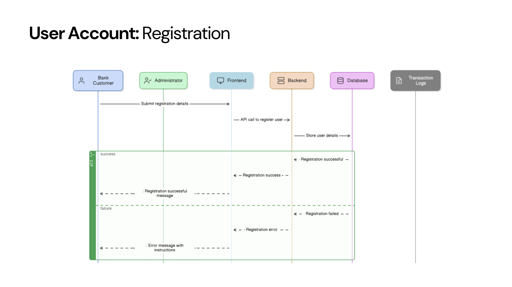
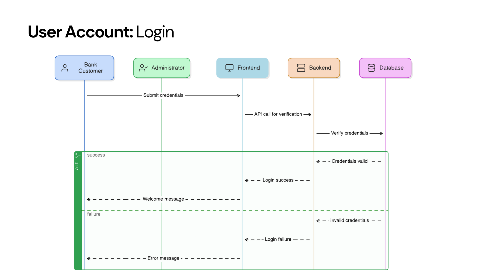
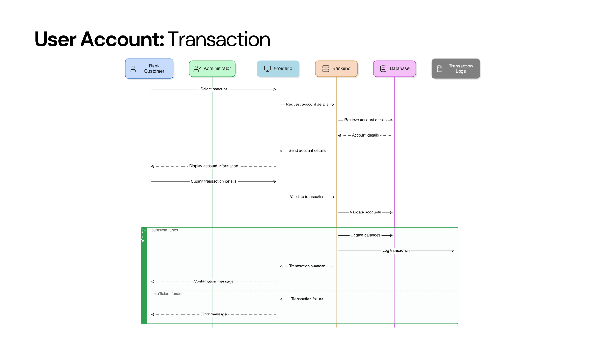
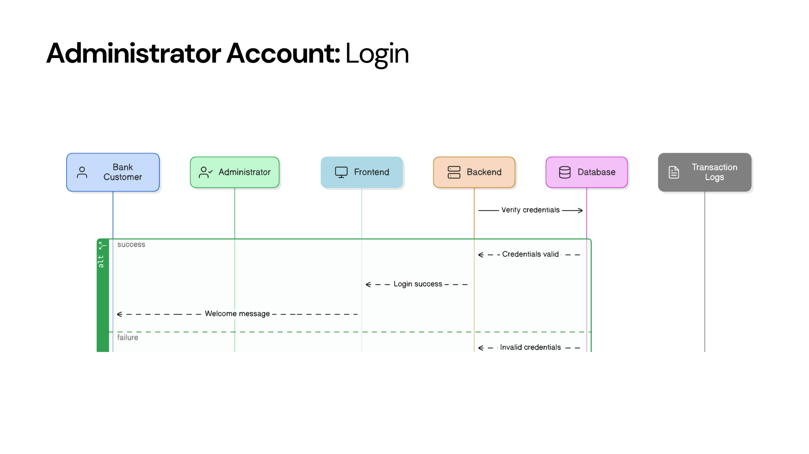
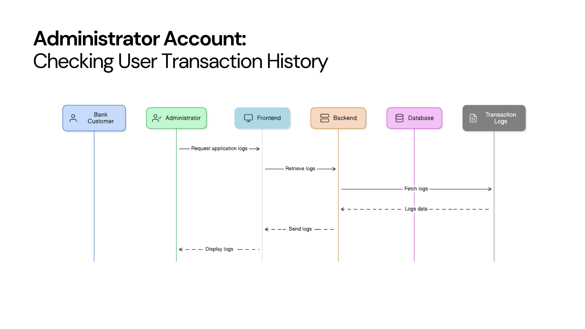
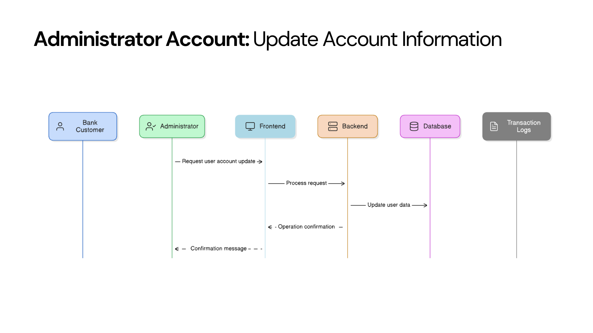
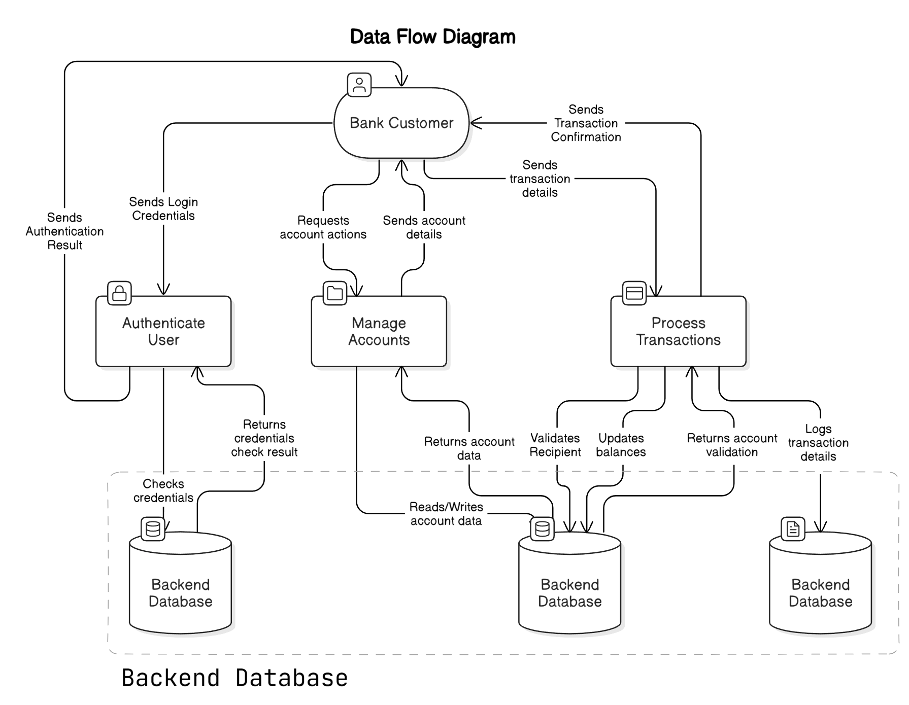
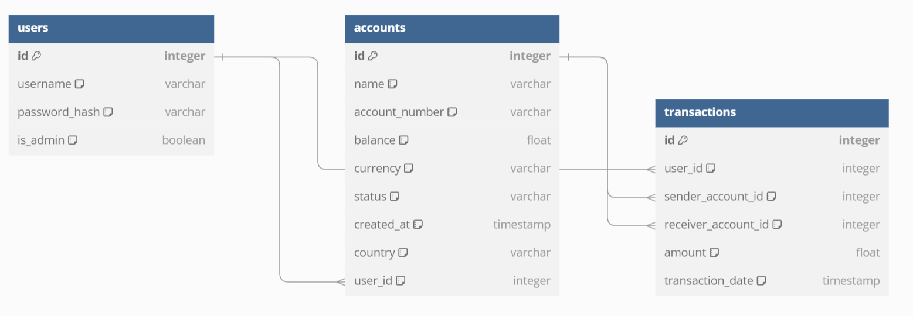

# [Home](index.md)

- [Well Architected Framework](#well-architected-framework)
- [Infrastructure Architecture Design](#infrastructure-architecture-design)
  - [Infrastructure Configuration by Environment](#infrastructure-configuration-by-environment)
- [Environment Setup: DTAP Strategy](#environment-setup-dtap-strategy)
  - [Advantages of the DTAP Strategy](#advantages-of-the-dtap-strategy)
  - [Environment Details](#environment-details)
  - [CI/CD Workflow Across Environments](#cicd-workflow-across-environments)
- [Release Strategy](#release-strategy)
  - [Environment-Specific Design in the Release Strategy](#environment-specific-design-in-the-release-strategy)
  - [Key Components of the Release Strategy](#key-components-of-the-release-strategy)
  - [Deployment Triggers Across Environments](#deployment-triggers-across-environments)
  - [Benefits of the Release Strategy](#benefits-of-the-release-strategy)
- [Software Design and Planning](#software-design-and-planning)
- [12-Factor App Design](#12-factor-app-design)

---

# **Infrastructure Architecture Design**

The infrastructure for the IE Bank MVP is designed to ensure scalability, security, and cost-effectiveness, adhering to the functional and non-functional requirements of the application. Following a cloud-native approach, we leverage Microsoft Azure services to implement a robust DTAP (Development, Testing, Acceptance, Production) environment strategy. This design aligns with the Azure Well-Architected Framework and incorporates industry best practices.

---

## **Key Azure Services and Architecture Components**

### **Frontend Hosting: Azure Static Web Apps**
- **Purpose**: Hosts the Vue.js frontend application.
- **Features**:
  - Lightweight and cost-effective hosting solution.
  - Integrated CI/CD via GitHub Actions for streamlined deployments.
  - Supports global scalability and fast delivery of frontend assets.

### **Backend Hosting: Azure App Service**
- **Purpose**: Hosts the backend Python Flask application as a containerized service.
- **Features**:
  - Reliable and scalable hosting for API services.
  - Seamless integration with Azure monitoring tools.
  - Efficient container management and manual scaling.

### **Database: Azure Database for PostgreSQL**
- **Purpose**: Provides secure and scalable relational data storage.
- **Features**:
  - Utilizes Flexible Server mode for optimized cost and performance.
  - Offers robust backup and disaster recovery configurations for UAT and Production.

### **Container Management: Azure Container Registry (ACR)**
- **Purpose**: Stores Docker images for backend services.
- **Features**:
  - Basic SKU for Development and UAT; Standard SKU for Production.
  - Integrated with Azure Key Vault for secure credential management.

### **Secrets Management: Azure Key Vault**
- **Purpose**: Stores sensitive information such as PostgreSQL credentials and ACR authentication keys securely.
- **Features**:
  - Integrated into backend and CI/CD pipelines for automated secret retrieval.
  - Standard SKU across all environments for consistency and security.

### **Monitoring and Logging**
- **Azure Log Analytics**:
  - Centralized logging for infrastructure and applications.
  - Uses PerGB2018 SKU for scalable logging and analysis.
- **Azure Application Insights**:
  - Provides in-depth telemetry and performance monitoring for both frontend and backend applications.
  - Unified across all environments to maintain parity.
- **Azure Workbooks**:
  - Visualize log and metric data for actionable insights.
- **Azure Alerts**:
  - Real-time incident notifications for proactive issue resolution.

---

## **Infrastructure Configuration by Environment**

### **1. App Service Plan**
| **Environment** | **Name**               | **SKU**         | **Region**       | **Scaling**         |

|------------------|------------------------|-----------------|------------------|---------------------|
| DEV              | `devopps-asp-dev`     | Free (F1)       | Same as PROD     | Manual (1-2 instances) |
| UAT              | `devopps-asp-uat`     | Free (F1)       | Same as PROD     | Manual (1-2 instances) |
| PROD             | `devopps-asp-prod`    | Standard (B1)   | Same as PROD     | Manual (1-2 instances) |

### **2. App Service**
| **Environment** | **Name**               | **Purpose**                   | **Runtime**             |

|------------------|------------------------|--------------------------------|-------------------------|
| DEV              | `devopps-be-dev`      | Host backend API              | Python Flask (Docker)   |
| UAT              | `devopps-be-uat`      | Host backend API              | Python Flask (Docker)   |
| PROD             | `devopps-be-prod`     | Host backend API              | Python Flask (Docker)   |

### **3. Static Web App**
| **Environment** | **Name**               | **SKU**       | **Framework**  | **Purpose**            |

|------------------|------------------------|---------------|----------------|------------------------|
| DEV              | `devopps-swa-dev`     | Free          | Vue.js         | Serve frontend code    |
| UAT              | `devopps-swa-uat`     | Standard      | Vue.js         | Serve frontend code    |
| PROD             | `devopps-swa-prod`    | Standard      | Vue.js         | Serve frontend code    |

### **4. Azure Container Registry (ACR)**
| **Environment** | **Name**               | **SKU**       | **Purpose**               |

|------------------|------------------------|---------------|---------------------------|
| DEV              | `devopps-dev-acr`     | Basic         | Store backend Docker images |
| UAT              | `devopps-dev-uat`     | Basic         | Store backend Docker images |
| PROD             | `devopps-dev-prod`    | Standard      | Store backend Docker images |

### **5. PostgreSQL Server**
| **Environment** | **Name**               | **Deployment** | **Tier**                  | **Backup**          |

|------------------|------------------------|----------------|---------------------------|---------------------|
| DEV              | `devopps-dbsrv-dev`   | Single server  | Burstable Standard_B1ms   | Disabled            |
| UAT              | `devopps-dbsrv-uat`   | Single server  | Burstable Standard_B1ms   | Enabled             |
| PROD             | `devopps-dbsrv-prod`  | Single server  | Burstable Standard_B1ms   | Enabled             |

### **6. Azure Key Vault**
| **Environment** | **Name**               | **SKU**       | **Purpose**               |

|------------------|------------------------|---------------|---------------------------|
| DEV              | `devopps-kv-dev`      | Standard      | Securely store secrets    |
| UAT              | `devopps-kv-uat`      | Standard      | Securely store secrets    |
| PROD             | `devopps-kv-prod`     | Standard      | Securely store secrets    |

### **7. Azure Log Analytics**
| **Environment** | **Name**               | **SKU**       | **Purpose**               |

|------------------|------------------------|---------------|---------------------------|
| DEV              | `devopps-law-dev`     | PerGB2018     | Centralized logging       |
| UAT              | `devopps-law-uat`     | PerGB2018     | Centralized logging       |
| PROD             | `devopps-law-prod`    | PerGB2018     | Centralized logging       |

### **8. Azure Application Insights**
| **Environment** | **Name**               | **Purpose**                   |

|------------------|------------------------|--------------------------------|
| DEV              | `devopps-insights-dev`| Monitor backend/frontend telemetry |
| UAT              | `devopps-insights-uat`| Monitor backend/frontend telemetry |
| PROD             | `devopps-insights-prod`| Monitor backend/frontend telemetry |

---

With chosen infrastructure, IE Bank MVP's infrastructure architecture leverages Azure services to provide a robust, scalable, and cost-efficient environment. The use of a consistent DTAP strategy ensures that the application adheres to industry best practices while maintaining operational parity across all environments. This design delivers the scalability, security, and monitoring capabilities essential for modern cloud-native applications.

# **Environment Setup: DTAP Strategy**

The IE Bank MVP employs a structured DTAP (Development, Testing, Acceptance, Production) strategy to streamline the application lifecycle. By segregating environments, we ensure that each stage operates independently, supporting iterative development, thorough validation, and secure production releases. Leveraging Azure's cloud-native tools, this approach emphasizes reliability, scalability, and security.

---

## **Advantages of the DTAP Strategy**
1. **Predictable Deployments**:  
   - Standardized workflows ensure consistent results across environments.  

2. **Risk Mitigation**:  
   - Isolated stages prevent bugs or instability in Development from affecting Production.  

3. **Scalability**:  
   - Resources can be scaled incrementally as the application moves toward Production.  

4. **Enhanced Stakeholder Engagement**:  
   - UAT offers a preview of new features, enabling informed feedback and approval.

---

## **Environment Details**

### **Development Environment**
- **Resource Group**: `BCSAI2024-DEVOPS-STUDENTS-A-DEV`.  
- **Focus**:  
  - Accelerates feature development with minimal resource usage.  
  - Allows experimentation and real-time integration of new features through trunk-based development.  
- **Setup**:  
  - Continuous integration is triggered by feature branch commits, deploying directly to this environment.  
  - Azure Key Vault securely manages secrets like database credentials and API keys.

### **Testing/UAT Environment**
- **Resource Group**: `BCSAI2024-DEVOPS-STUDENTS-A-UAT`.  
- **Focus**:  
  - Provides a production-like environment to validate features and identify potential issues.  
  - Supports user acceptance testing (UAT) to confirm application readiness for deployment.  
- **Setup**:  
  - Integrated with automated testing workflows via GitHub Actions.  
  - Simulates production conditions, enabling stakeholders to review near-live functionality.

### **Production Environment**
- **Resource Group**: `BCSAI2024-DEVOPS-STUDENTS-A-PROD`.  
- **Focus**:  
  - Delivers a stable and highly secure environment optimized for end-user performance.  
  - Supports consistent uptime and scalability under varying workloads.  
- **Setup**:  
  - Deployments proceed only after rigorous validation in UAT.  
  - Enforces strict access controls and uses Key Vault for robust secrets management.

---

## **CI/CD Workflow Across Environments**

### **Development**
- Commits to feature branches initiate CI pipelines that deploy changes to the Development environment.  
- Real-time deployment provides immediate feedback, enabling iterative development.

### **UAT**
- Pull requests trigger testing pipelines, deploying to UAT after automated checks.  
- Stakeholders use this environment to test functionality in a setting that closely resembles Production.

### **Production**
- Merging into the `main` branch initiates automated workflows for deploying to Production.  
- Deployments require successful validation in UAT and adherence to security protocols.

---

## **Security and Environment Isolation**
- Each stage is hosted in a dedicated **Azure Resource Group**, ensuring complete isolation.  
- **Access Management**:  
  - Development is accessible to the team for flexibility.  
  - UAT and Production environments have tighter access controls to protect data and resources.  
- **Secret Management**:  
  - Secrets are securely stored and managed using Azure Key Vault.  
  - Automated key rotation and environment-specific permissions minimize security risks.
---

Given that the IE Bank MVP leverages a refined DTAP strategy to maintain a secure and reliable development pipeline. Supported by Azure's robust services and trunk-based development, this setup delivers a seamless, scalable, and efficient approach to application deployment while minimizing risks at every stage of the process.

# **Release Strategy**

The IE Bank MVP employs a comprehensive release strategy that ensures secure, reliable, and efficient deployments across Development, UAT, and Production environments. This strategy integrates environment-specific configurations, aligns with Azure DevOps best practices, and incorporates DevSecOps principles using GitHub Security.

---

## **Environment-Specific Design in the Release Strategy**

The release strategy adheres to the DTAP (Development, Testing, Acceptance, Production) model, creating isolated and purpose-driven environments. Each environment serves a distinct role in the application lifecycle:

### **Development Environment**
- **Purpose**:  
  - Active development, experimentation, and unit testing.  
- **Configuration**:  
  - Utilizes lightweight App Service plans and database tiers to minimize costs.  
  - Integrated with CI pipelines triggered by non-main branch commits.  
- **Deployment Trigger**:  
  - Pushes to any branch except `main` automatically trigger deployments to the Development environment.  

### **UAT Environment**
- **Purpose**:  
  - Validates functionality, gathers stakeholder feedback, and performs pre-production testing.  
- **Configuration**:  
  - Mimics Production configurations, including App Service scaling and database settings, for parity.  
  - Runs automated functional tests and supports manual quality assurance (QA) processes.  
- **Deployment Trigger**:  
  - Pull Requests (PRs) to the `main` branch initiate deployments to the UAT environment.  

### **Production Environment**
- **Purpose**:  
  - Serves as the live, end-user-facing environment.  
- **Configuration**:  
  - Employs high-availability services and redundancy, such as zone-redundant PostgreSQL configurations.  
  - Enforces secure configurations and monitoring with tools like Key Vault and Log Analytics Workspace.  
- **Deployment Trigger**:  
  - Pushes to the `main` branch initiate Production deployments, which can only occur after all UAT workflows, tests, and validations pass, and the PR is approved.

---

## **Key Components of the Release Strategy**

### **Source Control**
- All application code, including Infrastructure as Code (IaC), is stored in GitHub repositories.  
- Feature branching strategy with branch policies, including PR reviews and status checks, ensures code quality and governance.

### **Continuous Integration/Continuous Delivery**
- **CI Pipelines**: Automate building, testing, and deploying applications.  
- **Environment-Specific Pipelines**:  
  - Feature branches → Development.  
  - PRs → UAT.  
  - Merges into `main` → Production.  
- Deployment to Production requires successful completion of all preceding workflows, tests, and validations.

### **Testing**
- **Unit Tests**: Implemented for the backend (using `pytest`) and APIs (using Postman).  
- **Automated Functional Tests**: Mandatory for UAT deployments to ensure application functionality and reliability.  
- **Deployment Strategies**: Future updates may include canary or blue-green deployment approaches for critical Production changes.  

### **Infrastructure as Code (IaC)**
- Infrastructure is modularized and defined using Azure Bicep.  
- Parameterized templates are used for environment-specific configurations, ensuring consistency and scalability.

### **Monitoring and Logging**
- **Centralized Logging**: Application and infrastructure logs are aggregated in Azure Log Analytics Workspace.  
- **Proactive Monitoring**: Alerts and dashboards provide real-time insights and detect issues before they impact users.  
- **Azure Workbooks**: Visualizations are available to support operational monitoring and incident response.

---

## **Deployment Triggers Across Environments**

1. **Development**:  
   - Triggered by pushes to any branch other than `main`.  
   - Enables rapid feedback loops for developers.  

2. **UAT**:  
   - Triggered by Pull Requests (PRs) to the `main` branch.  
   - Deployments validate application functionality and serve as the final stage for stakeholder reviews.  

3. **Production**:  
   - Triggered by pushes to the `main` branch, which can only occur via approved PRs.  
   - For a PR to be merged, all prior workflows and tests must be completed successfully, including CI and UAT validations.

---

## **Benefits of the Release Strategy**

1. **Secure Deployments**:  
   - Isolation of environments and strict access controls reduce risks of unauthorized changes.  

2. **Reliability**:  
   - Automated testing and gated workflows ensure only validated code is deployed.  

3. **Efficiency**:  
   - Streamlined CI/CD pipelines minimize manual interventions and accelerate releases.  

4. **Stakeholder Engagement**:  
   - The UAT environment provides a near-live preview for feedback and approval, ensuring alignment with expectations.

---

## **Conclusion**

The release strategy for the IE Bank MVP ensures a robust, secure, and streamlined deployment process. By leveraging GitHub workflows, Azure services, and DTAP principles, the application achieves consistent quality and operational reliability across all stages of its lifecycle.

## Well-Architected Framework

### ***Operational Excellence Pillar***

Focuses on automating operations and improving processes to deliver business value effectively.

#### **Deployment Strategies**
- **Continuous Integration and Deployment**:  
  - Implemented a Git feature branch strategy with CI/CD pipelines on GitHub.  
  - Protected the main branch with policies and integrated workflows for consistent deployments to Development, UAT, and Production environments.  
- **Environment Provisioning**:  
  - Used Bicep IaC with modular templates to provision consistent environments across all stages.  

#### **Monitoring and Diagnostics**
- **Monitoring Tools**:  
  - Deployed Azure Monitor and Application Insights to track application and infrastructure performance.  
- **Custom Metrics**:  
  - Configured Service Level Indicators (SLIs) and Service Level Objectives (SLOs) to ensure compliance with SLA targets.  
  - Designed Azure Workbooks for detailed logs and metrics visualization.  

#### **Incident Management**
- **Real-Time Notifications**:  
  - Integrated Azure Alerts with Slack for instant incident notifications.  
- **Automated Recovery**:  
  - Leveraged Azure Automation for quick incident recovery, minimizing downtime.  
- **Documentation and Tracking**:  
  - Utilized GitHub for comprehensive documentation, workflows, and incident tracking.  

#### **Continuous Improvement**
- Conducted regular retrospectives after sprints and implemented feedback loops to optimize workflows and improve operational efficiency.  

#### **Enhancing Reliability**
- Adopted reliable and scalable practices to minimize downtime and ensure system availability.

---

### ***Cost Optimization Pillar***

Minimizes costs by eliminating waste, using appropriate pricing models, and aligning resources with needs.

#### **Cost-Efficient Infrastructure Provisioning**
- **Infrastructure as Code (IaC)**: Used Bicep templates to dynamically deploy resources, avoiding expensive alternatives.  
- **Right-Sizing Resources**: Selected appropriate SKUs and set usage alerts to detect and reduce excessive resource usage.  

#### **Cost Monitoring and Analysis**
- Azure App Services (B1 plans), PostgreSQL Flexible Server (Standard_B1ms), and Static Web Apps with CDN ensure efficient resource allocation.  
- Environment-specific retention policies for Application Insights and Log Analytics (30-90 days).  
- Slack-integrated Logic Apps provide real-time alerts for cost monitoring.

#### **Automation for Cost Reduction**
- **Auto-Scaling**: Configured only for production to avoid unnecessary costs in Development and UAT environments.  
- **Automated Shutdown**: Future plans include shutting down low-demand resources using Azure Automations.  
- **Cleanup of Unused Resources**: Automated scripts will identify and remove unused resources to cut costs.

#### **Continuous Cost Optimization**
- **Monthly Cost Reviews**: Regular reviews with the Infrastructure Team to assess and adjust spending.  
- **Cost Forecasting**: Develop cost projections to predict and manage expenses.

#### **Operational Processes**
- **Cost-Effective Backup Strategy**: Backups implemented only in production using Azure Backup, optimizing costs while maintaining reliability.

---

### ***Performance Optimization Pillar***

Optimizes resource use by selecting the right configurations, scaling efficiently, and leveraging technology.

#### **Efficient Resource Utilization**
- **Right-Sizing Resources**: Continuously monitor utilization of Azure App Service, App Service Plan, and Postgres SQL Server to ensure resource allocation aligns with workload requirements.  
- **Auto-Scaling**: Configure auto-scaling for compute and storage resources to adjust dynamically based on demand, optimizing resource allocation.  
- **Load Balancing**: Plan to implement Azure Load Balancer and Application Gateway to distribute traffic evenly across instances.  

#### **Optimization for Scalability**
- **Content Delivery Network (CDN)**: Introduce Azure CDN for faster content delivery by caching static content closer to users, reducing latency.  
- **Microservices Architecture**: Modularize IaC templates for independent components like authentication and API services, enabling horizontal scaling.

#### **Cost-Effective Performance Improvements**
- **Caching Mechanisms**: Implement caching strategies using Azure Cache for Redis to reduce database query load and improve performance.  
- **Optimized Storage Solutions**: Define Azure Blob Storage configurations for efficient data management across Hot, Cool, and Archive tiers.  
- **Efficient Data Transfer**: Configure Azure ExpressRoute for optimized inter-region data transfer.  

#### **Continuous Performance Optimization**
- **Performance Testing**: Use Azure Load Testing for high-traffic simulations and consistent testing setups via IaC.  

#### **Enhancing System Efficiency**
- **Optimized Network Configuration**: Define Azure Front Door configurations for efficient routing and edge acceleration of static content.  
- **Sustainable Performance Practices**: Use basic SKUs for DEV/UAT environments and schedule automated shutdowns to conserve resources.

---

### ***Security Pillar***

Security ensures the protection of sensitive data and reduces vulnerabilities at every level, including code, infrastructure, and deployment.

#### **Design Features**

- **Azure Key Vault**:  
  - Manages secrets, connection strings, and sensitive credentials to safeguard sensitive information.  
  - Integrated into all services for secure storage and encryption, ensuring data is protected during development and operations.  

- **CI/CD Security Tools**:  
  - **CodeQL**: Performs semantic analysis to identify vulnerabilities in backend and frontend codebases.  
  - **OSSF Scorecard**: Monitors repositories for compliance with open-source security best practices, improving overall security posture.  

- **Dependency Management**:  
  - **Dependabot**: Automatically scans and identifies vulnerabilities in both direct and transitive dependencies, ensuring critical updates are applied promptly.  

- **Secrets Management**:  
  - GitHub Secret Scanning prevents accidental inclusion of secrets in the codebase.  
  - Push protection adds an additional layer to block sensitive information from being committed.  

- **Encryption**:  
  - Ensures sensitive data is always hashed and never stored in plain text, both in frontend and backend systems.  
  - Protects data in transit with industry-standard HTTPS and TLS protocols for secure communication between components.  

- **Threat Modeling**:  
  - Collaborated with architects to conduct threat modeling sessions, identifying potential attack vectors and incorporating resilient design principles.  

- **Secure Coding Practices**:  
  - Enforced coding standards to ensure the consistent use of secure functions and robust error handling mechanisms throughout the development process.  

This robust security framework incorporates industry best practices to ensure the protection of sensitive data, mitigate vulnerabilities, and maintain the integrity of the system across all stages of development and deployment.

---

### ***Reliability Pillar***

Ensures systems can recover from failures and meet operational demands through resilient design.

#### **Ensuring System Availability**
- **High-Availability Targets**:  
  - Define and maintain strict Service Level Objectives (SLOs):  
    - **99.99%** for Azure Static Web Apps (Standard tier).  
    - **99.9%** for Azure Key Vault (Standard tier).  
  - Leverage Azure's built-in high-availability features, including **CDN capabilities**, to provide consistent and dependable service accessibility.  
  - Use redundancy strategies to mitigate the impact of resource failures.

#### **Resilience through Backup and Recovery**
- **PostgreSQL Configuration**:  
  - Configure PostgreSQL Flexible Server with the **Standard_B1ms tier** in Burstable configuration for cost-effective, resilient database operations.  
  - Implement automated **backup retention policies** and **failover mechanisms** to ensure rapid recovery in case of failure.  
- **Soft Delete for Data Protection**:  
  - Enable **soft delete** for Azure Key Vault to safeguard critical data against accidental deletion.

#### **Monitoring and Alerting**
- **Real-Time Observability**:  
  - Combine Application Insights and Log Analytics Workspace for comprehensive monitoring:  
    - Application Insights with **90-day retention** for application metrics.  
    - Log Analytics Workspace with **30-day retention** for operational logs.  
  - Implement metric-based alerting for key performance indicators (KPIs), including:  
    - HTTP response time thresholds.  
    - CPU and memory usage alerts for PostgreSQL.  
- **Incident Notifications**:  
  - Use Azure Logic Apps for **Slack integration**, ensuring instant notifications for incidents and outages via webhooks.

#### **Fault Tolerance Mechanisms**
- **Infrastructure Resilience**:  
  - Deploy modular infrastructure using **Azure Bicep templates** for consistent and reliable provisioning.  
  - Include redundancy in design with fail-safe mechanisms and automated checks to ensure infrastructure stability.  
- **Graceful Degradation**:  
  - Build services that can gracefully degrade performance rather than fail outright under unexpected load or partial resource outages.

#### **Cost-Efficiency in Reliability**
- **Right-Sizing Resources**:  
  - Choose resource tiers like **B1 App Service Plan** for compute resources and **Standard tier Azure Container Registry** to balance performance and cost in production environments.  
- **Scalable Reliability**:  
  - Ensure scaling strategies align with production demands while minimizing over-provisioning.

By adopting these strategies, the reliability design ensures robust system performance, proactive issue detection, and a resilient infrastructure capable of handling failures without compromising user experience.

### Software Design and Planning

# **Sequence Diagram Descriptions**

Below are descriptions for the sequence diagrams provided, explaining their purpose and key interactions.

---

## **1. User Account: Registration**

- **Purpose**: This diagram details the process of user registration, from entering details to storing them in the database.
- **Flow**:
  - The user submits registration details.
  - The frontend sends the details to the backend via an API call.
  - The backend processes the registration request and stores the user details in the database.
  - A success or failure message is returned to the user.

---

## **2. User Account: Login**

- **Purpose**: This diagram demonstrates the login process for a user.
- **Flow**:
  - The user submits login credentials.
  - The frontend makes an API call to the backend to verify credentials.
  - The backend checks the credentials against the database.
  - If valid, a success message is sent to the user; otherwise, an error message is returned.

---

## **3. User Account: Transaction**

- **Purpose**: This diagram outlines the steps a user follows to initiate or view a transaction.
- **Flow**:
  - The user selects their account and submits transaction details.
  - The backend retrieves account details from the database and validates the transaction.
  - If the transaction is successful, balances are updated and a confirmation message is sent.
  - In case of insufficient funds, an error message is returned.

---

## **4. Administrator Account: Login**

- **Purpose**: This diagram explains the login process for an administrator.
- **Flow**:
  - The admin submits credentials via the frontend.
  - The backend verifies the credentials with the database.
  - If valid, the admin is granted access and a welcome message is displayed; otherwise, an error message is shown.

---

## **5. Administrator Account: Checking User Transaction History**

- **Purpose**: This diagram shows how an administrator retrieves a user's transaction history.
- **Flow**:
  - The admin requests transaction logs through the frontend.
  - The backend fetches the logs from the database and sends them to the admin for review.

---

## **6. Administrator Account: Update Account Information**

- **Purpose**: This diagram describes the process of updating a user's account details by an administrator.
- **Flow**:
  - The admin submits a request to update user account information.
  - The backend processes the request and updates the database with the new information.
  - A confirmation message is sent to the admin upon successful completion.

---

These sequence diagrams visually represent the key processes and workflows for user and administrator interactions within the application. Each diagram ensures clarity and aligns with the system's functional requirements.

---

## Use Case Diagrams

## Data Flow Diagram
- The Data Flow Diagram (DFD) which illustrates the movement of data within the system, highlighting inputs, outputs, processing steps, and storage locations.

## Entity Relationship Diagram
- The Entity Relationship Diagram (ERD) outlines the database schema and illustrates the relationships between entities within the database.

## **12-Factor App Design**

### **Overview**  
The 12-Factor App methodology provides a set of best practices for building modern, scalable, and maintainable cloud-native applications. The IE Bank MVP adheres to these principles to ensure reliability, scalability, and ease of deployment across environments. Below is how each of the 12 factors is applied in the design and implementation of the product.

### Main Takeaways:
1. **Scalability**:  
   - Horizontal scaling and seamless transitions between environments are built into the architecture.  

2. **Maintainability**:  
   - Clear separation of concerns simplifies debugging, onboarding, and ongoing application updates.  

3. **Resilience**:  
   - Stateless processes and decoupled services ensure robust failover and recovery mechanisms.  

---

### **1. Codebase**  
**A single codebase tracked in version control, with multiple deployments.**  
- **Implementation**:  
  - Two GitHub repositories host the code: one for the frontend (Vue.js) and one for the backend (Python Flask).  
  - Modularized infrastructure code is stored in a separate repository, leveraging Azure Bicep.  
  - Branching strategy: Feature branches for development; `main` branch for production deployments.  

---

### **2. Dependencies**  
**Explicitly declare and isolate dependencies.**  
- **Implementation**:  
  - Backend dependencies are declared in `requirements.txt` and managed using `pip`.  
  - Frontend dependencies are specified in `package.json` and managed via `npm`.  
  - Docker ensures isolated environments with consistent dependencies for development and deployment.  

---

### **3. Configuration**  
**Store configuration in the environment, not in the code.**  
- **Implementation**:  
  - Sensitive credentials (e.g., database connections, API keys) are securely managed using **Azure Key Vault**.  
  - Environment-specific configurations are defined in **Bicep parameter files**.  
  - Application settings, such as UAT vs. Production, are managed via **Azure App Service settings**.  

---

### **4. Backing Services**  
**Treat backing services (e.g., databases, queues) as attached resources.**  
- **Implementation**:  
  - PostgreSQL is provisioned as a managed Azure service.  
  - Database credentials and secrets for external services are securely stored in **Key Vault**.  
  - Backend dynamically connects to resources based on environment-specific settings.  

---

### **5. Build, Release, Run**  
**Separate the build and run stages for deployment.**  
- **Implementation**:  
  - **Build**: CI pipelines create Docker images for the frontend and backend.  
  - **Release**: Artifacts are deployed to UAT for validation before production deployment.  
  - **Run**: Production deployments are triggered automatically after successful UAT validation.  

---

### **6. Processes**  
**Execute the app as one or more stateless processes.**  
- **Implementation**:  
  - Backend processes are stateless, with session data persisted in PostgreSQL.  
  - Frontend interacts dynamically through APIs, with no local state storage.  

---

### **7. Port Binding**  
**Expose services via port binding.**  
- **Implementation**:  
  - Backend is hosted on Azure App Services, exposing HTTP endpoints.  
  - Frontend is served via Azure Static Web Apps, communicating with the backend using RESTful APIs.  

---

### **8. Concurrency**  
**Scale out via the process model.**  
- **Implementation**:  
  - Autoscaling is enabled for both the backend App Service and PostgreSQL database in Production.  
  - Azure’s built-in load balancer ensures support for concurrent requests without manual intervention.  

---

### **9. Disposability**  
**Maximize robustness with fast startup and graceful shutdown.**  
- **Implementation**:  
  - Dockerized applications ensure fast and consistent startups across environments.  
  - Graceful shutdown mechanisms protect active requests during service termination.  

---

### **10. Dev/Prod Parity**  
**Keep development, staging, and production as similar as possible.**  
- **Implementation**:  
  - DTAP (Development, Test, Acceptance, Production) environments are provisioned using the same **Bicep templates** to ensure consistency.  
  - Monitoring and telemetry are managed uniformly across all environments using **Application Insights** and **Log Analytics Workspace**.  

---

### **11. Logs**  
**Treat logs as event streams.**  
- **Implementation**:  
  - Logs from applications and infrastructure are centralized in **Log Analytics Workspace**.  
  - Performance and error telemetry for frontend and backend are captured using **Application Insights**.  

---

### **12. Admin Processes**  
**Run admin/management tasks as one-off processes.**  
- **Implementation**:  
  - Database migrations are run as one-off commands during CI/CD pipeline executions.  
  - Monitoring and incident response tasks are automated using **Azure CLI** and custom scripts.  

---

### **Summary**

By aligning with the **12-Factor App principles**, the IE Bank MVP adopts a cloud-native design optimized for modern application development. These practices ensure scalability, maintainability, and operational efficiency, providing a solid foundation for continuous integration and delivery.  

