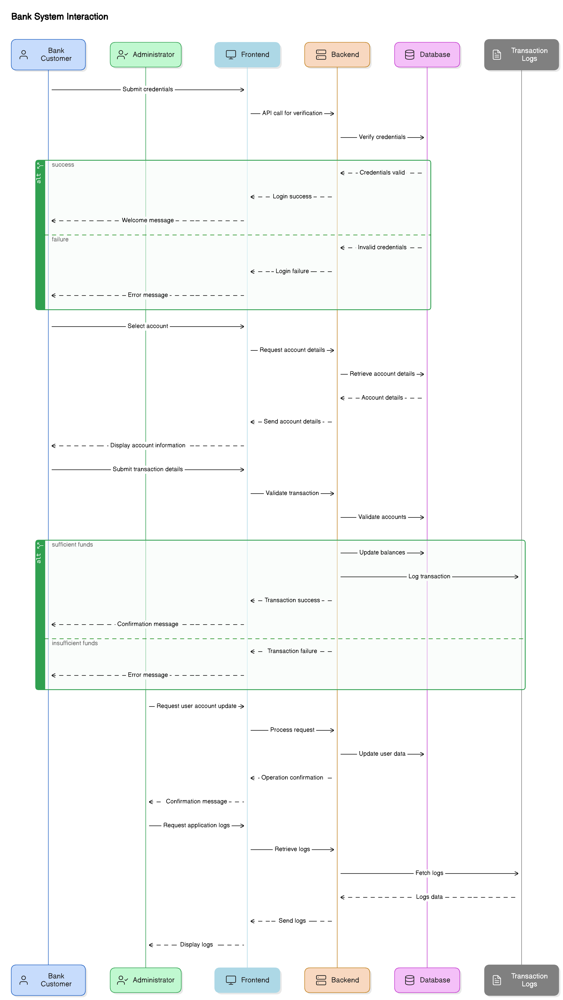

# [Home](index.md)

- [Well Architected Framework](#well-architected-framework)
- [Software Design and Planning](#software-design-and-planning) 

### Software Design and Planning

#### Sequence Diagram/s
<!--  -->

#### Data Flow
- The Data Flow Diagram (DFD) which illustrates the movement of data within the system, highlighting inputs, outputs, processing steps, and storage locations.

### Entity Relationship Diagram
- The Entity Relationship Diagram (ERD) outlines the database schema and illustrates the relationships between entities within the database.

## **12-Factor App Design**

### **Overview**  
The 12-Factor App methodology provides a set of best practices for building modern, scalable, and maintainable cloud-native applications. The IE Bank MVP adheres to these principles to ensure reliability, scalability, and ease of deployment across environments. Below is how each of the 12 factors is applied in the design and implementation of the product.

### Main Takeaways:
1. **Scalability**:  
   - Horizontal scaling and seamless transitions between environments are built into the architecture.  

2. **Maintainability**:  
   - Clear separation of concerns simplifies debugging, onboarding, and ongoing application updates.  

3. **Resilience**:  
   - Stateless processes and decoupled services ensure robust failover and recovery mechanisms.  

---

### **1. Codebase**  
**A single codebase tracked in version control, with multiple deployments.**  
- **Implementation**:  
  - Two GitHub repositories host the code: one for the frontend (Vue.js) and one for the backend (Python Flask).  
  - Modularized infrastructure code is stored in a separate repository, leveraging Azure Bicep.  
  - Branching strategy: Feature branches for development; `main` branch for production deployments.  

---

### **2. Dependencies**  
**Explicitly declare and isolate dependencies.**  
- **Implementation**:  
  - Backend dependencies are declared in `requirements.txt` and managed using `pip`.  
  - Frontend dependencies are specified in `package.json` and managed via `npm`.  
  - Docker ensures isolated environments with consistent dependencies for development and deployment.  

---

### **3. Configuration**  
**Store configuration in the environment, not in the code.**  
- **Implementation**:  
  - Sensitive credentials (e.g., database connections, API keys) are securely managed using **Azure Key Vault**.  
  - Environment-specific configurations are defined in **Bicep parameter files**.  
  - Application settings, such as UAT vs. Production, are managed via **Azure App Service settings**.  

---

### **4. Backing Services**  
**Treat backing services (e.g., databases, queues) as attached resources.**  
- **Implementation**:  
  - PostgreSQL is provisioned as a managed Azure service.  
  - Database credentials and secrets for external services are securely stored in **Key Vault**.  
  - Backend dynamically connects to resources based on environment-specific settings.  

---

### **5. Build, Release, Run**  
**Separate the build and run stages for deployment.**  
- **Implementation**:  
  - **Build**: CI pipelines create Docker images for the frontend and backend.  
  - **Release**: Artifacts are deployed to UAT for validation before production deployment.  
  - **Run**: Production deployments are triggered automatically after successful UAT validation.  

---

### **6. Processes**  
**Execute the app as one or more stateless processes.**  
- **Implementation**:  
  - Backend processes are stateless, with session data persisted in PostgreSQL.  
  - Frontend interacts dynamically through APIs, with no local state storage.  

---

### **7. Port Binding**  
**Expose services via port binding.**  
- **Implementation**:  
  - Backend is hosted on Azure App Services, exposing HTTP endpoints.  
  - Frontend is served via Azure Static Web Apps, communicating with the backend using RESTful APIs.  

---

### **8. Concurrency**  
**Scale out via the process model.**  
- **Implementation**:  
  - Autoscaling is enabled for both the backend App Service and PostgreSQL database in Production.  
  - Azure’s built-in load balancer ensures support for concurrent requests without manual intervention.  

---

### **9. Disposability**  
**Maximize robustness with fast startup and graceful shutdown.**  
- **Implementation**:  
  - Dockerized applications ensure fast and consistent startups across environments.  
  - Graceful shutdown mechanisms protect active requests during service termination.  

---

### **10. Dev/Prod Parity**  
**Keep development, staging, and production as similar as possible.**  
- **Implementation**:  
  - DTAP (Development, Test, Acceptance, Production) environments are provisioned using the same **Bicep templates** to ensure consistency.  
  - Monitoring and telemetry are managed uniformly across all environments using **Application Insights** and **Log Analytics Workspace**.  

---

### **11. Logs**  
**Treat logs as event streams.**  
- **Implementation**:  
  - Logs from applications and infrastructure are centralized in **Log Analytics Workspace**.  
  - Performance and error telemetry for frontend and backend are captured using **Application Insights**.  

---

### **12. Admin Processes**  
**Run admin/management tasks as one-off processes.**  
- **Implementation**:  
  - Database migrations are run as one-off commands during CI/CD pipeline executions.  
  - Monitoring and incident response tasks are automated using **Azure CLI** and custom scripts.  

---

### **Summary**

By aligning with the **12-Factor App principles**, the IE Bank MVP adopts a cloud-native design optimized for modern application development. These practices ensure scalability, maintainability, and operational efficiency, providing a solid foundation for continuous integration and delivery.  

---

## Well-Architected Framework

### ***Operational Excellence Pillar***

Focuses on automating operations and improving processes to deliver business value effectively.

#### **Deployment Strategies**
- **Continuous Integration and Deployment**:  
  - Implemented a Git feature branch strategy with CI/CD pipelines on GitHub.  
  - Protected the main branch with policies and integrated workflows for consistent deployments to Development, UAT, and Production environments.  
- **Environment Provisioning**:  
  - Used Bicep IaC with modular templates to provision consistent environments across all stages.  

#### **Monitoring and Diagnostics**
- **Monitoring Tools**:  
  - Deployed Azure Monitor and Application Insights to track application and infrastructure performance.  
- **Custom Metrics**:  
  - Configured Service Level Indicators (SLIs) and Service Level Objectives (SLOs) to ensure compliance with SLA targets.  
  - Designed Azure Workbooks for detailed logs and metrics visualization.  

#### **Incident Management**
- **Real-Time Notifications**:  
  - Integrated Azure Alerts with Slack for instant incident notifications.  
- **Automated Recovery**:  
  - Leveraged Azure Automation for quick incident recovery, minimizing downtime.  
- **Documentation and Tracking**:  
  - Utilized GitHub for comprehensive documentation, workflows, and incident tracking.  

#### **Continuous Improvement**
- Conducted regular retrospectives after sprints and implemented feedback loops to optimize workflows and improve operational efficiency.  

#### **Enhancing Reliability**
- Adopted reliable and scalable practices to minimize downtime and ensure system availability.

---

### ***Cost Optimization Pillar***

Minimizes costs by eliminating waste, using appropriate pricing models, and aligning resources with needs.

#### **Cost-Efficient Infrastructure Provisioning**
- **Infrastructure as Code (IaC)**: Used Bicep templates to dynamically deploy resources, avoiding expensive alternatives.  
- **Right-Sizing Resources**: Selected appropriate SKUs and set usage alerts to detect and reduce excessive resource usage.  

#### **Cost Monitoring and Analysis**
- Azure App Services (B1 plans), PostgreSQL Flexible Server (Standard_B1ms), and Static Web Apps with CDN ensure efficient resource allocation.  
- Environment-specific retention policies for Application Insights and Log Analytics (30-90 days).  
- Slack-integrated Logic Apps provide real-time alerts for cost monitoring.

#### **Automation for Cost Reduction**
- **Auto-Scaling**: Configured only for production to avoid unnecessary costs in Development and UAT environments.  
- **Automated Shutdown**: Future plans include shutting down low-demand resources using Azure Automations.  
- **Cleanup of Unused Resources**: Automated scripts will identify and remove unused resources to cut costs.

#### **Continuous Cost Optimization**
- **Monthly Cost Reviews**: Regular reviews with the Infrastructure Team to assess and adjust spending.  
- **Cost Forecasting**: Develop cost projections to predict and manage expenses.

#### **Operational Processes**
- **Cost-Effective Backup Strategy**: Backups implemented only in production using Azure Backup, optimizing costs while maintaining reliability.

---

### ***Performance Optimization Pillar***

Optimizes resource use by selecting the right configurations, scaling efficiently, and leveraging technology.

#### **Efficient Resource Utilization**
- **Right-Sizing Resources**: Continuously monitor utilization of Azure App Service, App Service Plan, and Postgres SQL Server to ensure resource allocation aligns with workload requirements.  
- **Auto-Scaling**: Configure auto-scaling for compute and storage resources to adjust dynamically based on demand, optimizing resource allocation.  
- **Load Balancing**: Plan to implement Azure Load Balancer and Application Gateway to distribute traffic evenly across instances.  

#### **Optimization for Scalability**
- **Content Delivery Network (CDN)**: Introduce Azure CDN for faster content delivery by caching static content closer to users, reducing latency.  
- **Microservices Architecture**: Modularize IaC templates for independent components like authentication and API services, enabling horizontal scaling.

#### **Cost-Effective Performance Improvements**
- **Caching Mechanisms**: Implement caching strategies using Azure Cache for Redis to reduce database query load and improve performance.  
- **Optimized Storage Solutions**: Define Azure Blob Storage configurations for efficient data management across Hot, Cool, and Archive tiers.  
- **Efficient Data Transfer**: Configure Azure ExpressRoute for optimized inter-region data transfer.  

#### **Continuous Performance Optimization**
- **Performance Testing**: Use Azure Load Testing for high-traffic simulations and consistent testing setups via IaC.  

#### **Enhancing System Efficiency**
- **Optimized Network Configuration**: Define Azure Front Door configurations for efficient routing and edge acceleration of static content.  
- **Sustainable Performance Practices**: Use basic SKUs for DEV/UAT environments and schedule automated shutdowns to conserve resources.

---

### ***Security Pillar***

Security ensures the protection of sensitive data and reduces vulnerabilities at every level, including code, infrastructure, and deployment.

#### **Design Features**

- **Azure Key Vault**:  
  - Manages secrets, connection strings, and sensitive credentials to safeguard sensitive information.  
  - Integrated into all services for secure storage and encryption, ensuring data is protected during development and operations.  

- **CI/CD Security Tools**:  
  - **CodeQL**: Performs semantic analysis to identify vulnerabilities in backend and frontend codebases.  
  - **OSSF Scorecard**: Monitors repositories for compliance with open-source security best practices, improving overall security posture.  

- **Dependency Management**:  
  - **Dependabot**: Automatically scans and identifies vulnerabilities in both direct and transitive dependencies, ensuring critical updates are applied promptly.  

- **Secrets Management**:  
  - GitHub Secret Scanning prevents accidental inclusion of secrets in the codebase.  
  - Push protection adds an additional layer to block sensitive information from being committed.  

- **Encryption**:  
  - Ensures sensitive data is always hashed and never stored in plain text, both in frontend and backend systems.  
  - Protects data in transit with industry-standard HTTPS and TLS protocols for secure communication between components.  

- **Threat Modeling**:  
  - Collaborated with architects to conduct threat modeling sessions, identifying potential attack vectors and incorporating resilient design principles.  

- **Secure Coding Practices**:  
  - Enforced coding standards to ensure the consistent use of secure functions and robust error handling mechanisms throughout the development process.  

This robust security framework incorporates industry best practices to ensure the protection of sensitive data, mitigate vulnerabilities, and maintain the integrity of the system across all stages of development and deployment.

---

### ***Reliability Pillar***

Ensures systems can recover from failures and meet operational demands through resilient design.

#### **Ensuring System Availability**
- **High-Availability Targets**:  
  - Define and maintain strict Service Level Objectives (SLOs):  
    - **99.99%** for Azure Static Web Apps (Standard tier).  
    - **99.9%** for Azure Key Vault (Standard tier).  
  - Leverage Azure's built-in high-availability features, including **CDN capabilities**, to provide consistent and dependable service accessibility.  
  - Use redundancy strategies to mitigate the impact of resource failures.

#### **Resilience through Backup and Recovery**
- **PostgreSQL Configuration**:  
  - Configure PostgreSQL Flexible Server with the **Standard_B1ms tier** in Burstable configuration for cost-effective, resilient database operations.  
  - Implement automated **backup retention policies** and **failover mechanisms** to ensure rapid recovery in case of failure.  
- **Soft Delete for Data Protection**:  
  - Enable **soft delete** for Azure Key Vault to safeguard critical data against accidental deletion.

#### **Monitoring and Alerting**
- **Real-Time Observability**:  
  - Combine Application Insights and Log Analytics Workspace for comprehensive monitoring:  
    - Application Insights with **90-day retention** for application metrics.  
    - Log Analytics Workspace with **30-day retention** for operational logs.  
  - Implement metric-based alerting for key performance indicators (KPIs), including:  
    - HTTP response time thresholds.  
    - CPU and memory usage alerts for PostgreSQL.  
- **Incident Notifications**:  
  - Use Azure Logic Apps for **Slack integration**, ensuring instant notifications for incidents and outages via webhooks.

#### **Fault Tolerance Mechanisms**
- **Infrastructure Resilience**:  
  - Deploy modular infrastructure using **Azure Bicep templates** for consistent and reliable provisioning.  
  - Include redundancy in design with fail-safe mechanisms and automated checks to ensure infrastructure stability.  
- **Graceful Degradation**:  
  - Build services that can gracefully degrade performance rather than fail outright under unexpected load or partial resource outages.

#### **Cost-Efficiency in Reliability**
- **Right-Sizing Resources**:  
  - Choose resource tiers like **B1 App Service Plan** for compute resources and **Standard tier Azure Container Registry** to balance performance and cost in production environments.  
- **Scalable Reliability**:  
  - Ensure scaling strategies align with production demands while minimizing over-provisioning.

By adopting these strategies, the reliability design ensures robust system performance, proactive issue detection, and a resilient infrastructure capable of handling failures without compromising user experience.

