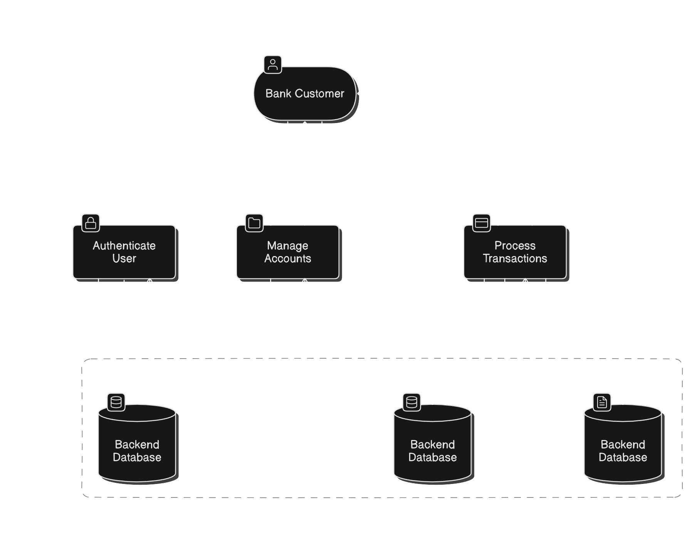
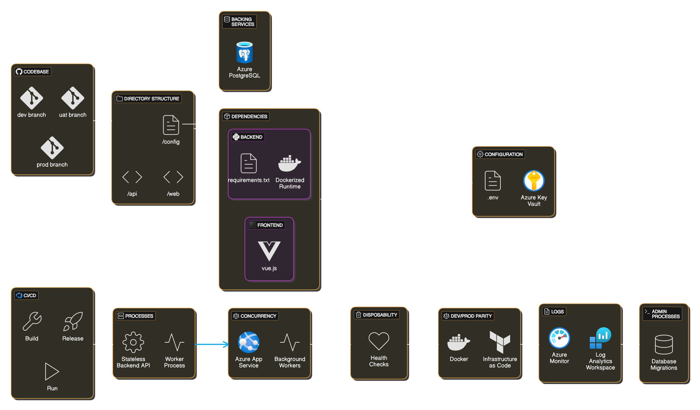

# [Home](index.md)

- [Well Architected Framework](#well-architected-framework)
- [Software Design and Planning](#software-design-and-planning) 

### Software Design and Planning

#### Sequence Diagram/s
<!--  -->

#### Data Flow
<!--  -->

### Entity Relationship Diagram
<!--  -->

#### 12 Factor App
<!--  -->

## Well-Architected Framework

### ***Operational Excellence Pillar***

#### Deployment Strategies
- Continuous Integration and Deployment: Adopted Git feature branch strategy with CI/CD pipelines on GitHub. Protected main branch with policies and integrated deployment workflows to Development, UAT, and Production environments.
- Environment Provisioning: Provisioned environments using Bicep IaC with modularized templates for consistent deployments across Development, UAT, and Production.
#### Monitoring and Diagnostics
- Monitoring Tools: Implemented Azure Monitor and Application Insights for tracking application and infrastructure performance.
- Custom Metrics: Configured SLIs and SLOs to make sure we complie with defined SLA targets.
- Designed Azure Workbooks for log and metrics
#### Incident Management
- Integrated Azure Alerts with Slack so we get real-time incident notifications 
- Azure Automation int he use of incident recovery to minimise the downtime of our implementation
- Imade use of GitHub to record all our documentation, and workflows, and keep track of incident 
#### Continuous Improvement
- Regular retrospectives of post sprints and feedback loops to optimize our workflows. 
<!-- #### Operational Processes
- Daily backups automated and verified with Azure Backup. DO WE HAVE DAILY BACKUPS
- Policy compliance enforced with Azure Policy and monitored for drift. DO WE HAVE THIS??? to a certain extent  -->
#### Enhancing Reliability
- Reliable and scalable practices to minimize the downtime.

---

### ***Cost Optimization Pillar***

#### Cost-Efficient Infrastructure Provisioning
- ⁠Infrastructure as Code (IaC): Leveraged Bicep IaC templates for deploying resources dynamically as a part of a CI/CD pipeline, removing the need for using more expensive PaaS alternatives.
-⁠  ⁠Right-Sizing Resources: Apart from having chosen the adequate resources and proper SKUs for the power and output needed for the project, resource usage alerts are set in place to detect excessive use of resources and scale down if necessary, reducing costs effectively.

#### Cost Monitoring and Analysis 

Our Azure infrastructure implements a comprehensive three-tier environment strategy (Development, UAT, and Production) with environment-specific optimizations. The infrastructure utilizes Azure App Services with B1 plans, PostgreSQL Flexible Server with Standard_B1ms/Burstable configurations, and Static Web Apps with built-in CDN capabilities. Security is managed through Azure Key Vault (Standard tier) with environment-appropriate soft delete policies. Container management is handled by Azure Container Registry (Standard tier, $20/month), providing essential features with 100GB storage. Monitoring and observability are implemented through Application Insights and Log Analytics, with retention periods of 30-90 days depending on the environment. The solution includes automated alerting through Logic Apps integrated with Slack for real-time monitoring. Cost optimization is achieved through strategic resource sizing, burstable compute options, and environment-specific retention policies. Production environment maintains higher reliability standards while development and UAT environments optimize for cost-efficiency. The infrastructure leverages Azure's pay-as-you-go pricing model where applicable, implementing right-sized resources specific to each environment's needs. This setup ensures a predictable monthly cost structure while maintaining the capability to scale when required, with total monthly costs varying from approximately $50-100 for development/UAT to $150-200 for production environments.

#### Automation for Cost Reduction
-⁠  ⁠Auto-Scaling: Only configured auto-scaling for production, ensuring that the project does not incur in unnecessary charges for UAT and Development environments.
-⁠  ⁠Automated Shutdown: In the future, set up the automatic shutdown of resources (like containers) on low-demand times using Azure Automations. Pairing this technique with automatic bootup would result in extremely efficient resource usage.
-  ⁠Cleanup of Unused Resources: In the future, implement automated scripts for identifying and cleaning up unused resources to prevent unnecessary costs.
  
#### Continuous Cost Optimization
-  ⁠Monthly Cost Reviews: Monthly cost review sessions are set to be carried out between the members and different teams of DevOpps Bank. Led by the Infrastructure Team, these sessions are meant to give the team an overview of the monthly costs and decide if changes are needed.
-⁠  ⁠Cost Forecasting: Create a forecast of the expected costs considering the resources and cloud services employed. This would be done by the Infrastructure Team with the Administrative departments of Devopps Bank.

#### Operational Processes
- ⁠Cost-Effective Backup Strategy: Used Azure Backup for reliable and cost-efficient backup solutions, ensuring backups are stored with the least expensive options without sacrificing performance. Also, backups are only implemented in production, which allows the team to save costs on UAT and Development environments.

### ***Performance Optimization Pillar***

#### Efficient Resource Utilization
- Right-Sizing Resources: Continuously monitor utilisation of Azure App Service, App Service Plan, and Postgres SQL Server to ensure resource allocation aligns with workload requirements. Avoid over-provisioning by scaling compute and memory allocations based on telemetry data collected via Azure Monitor and Log Analytics.
- Auto-Scaling: For future implementation configure auto-scaling for both compute and storage resources to dynamically adjust based on demand, optimising resource allocation and ensuring performance during peak times.
- Load Balancing: For future advances implement Azure Load Balancer and Application Gateway to evenly distribute traffic across multiple instances.

#### Optimization for Scalability
- Content Delivery Network (CDN): For future introduce Azure CDN for faster content delivery to users by caching static content closer to them, reducing latency and improving overall application responsiveness.
- Microservices Architecture: For future, modularised IaC templates to define and provision independent components, such as authentication, data processing, and API services, enabling their horizontal scaling as needed.

#### Cost-Effective Performance Improvements
- Caching Mechanisms: For future, implemnt  caching strategies using Azure Cache for Redis to store frequently accessed data, reducing the need for repeated database queries and improving application performance.
- Optimized Storage Solutions: Define Azure Blob Storage configurations in IaC, specifying Hot, Cool, and Archive tiers for storage efficiency based on data access patterns.
- Efficient Data Transfer: For future, define Azure ExpressRoute configurations and bandwidth allocation in IaC for inter-region data transfer optimisation.

#### Continuous Performance Optimization
- Performance Testing: For future, use Azure Load Testing resources for simulating high user traffic and validating performance before deployment. Automate test environment provisioning via IaC to ensure consistent testing setups.

#### Enhancing System Efficiency
- Optimized Network Configuration: For future, define Azure Front Door configurations for efficient traffic routing and edge acceleration of static content. Use IaC to configure private endpoints, firewall rules, and network security groups (NSGs) for optimized backend communication.
- Sustainable Performance Practices: The current SKU choices for different environment accordingly provide a sustainable performance by utilising basic tiers for DEV and UAT to provide energy efficiency. For future, Use IaC to schedule automated shutdowns of DEV environments outside business hours to conserve resources.

### ***Security Pillar***

## ***Reliability Pillar***

# Performance Efficiency

The performance efficiency design is built around carefully selected Azure resource tiers and monitoring thresholds. The infrastructure uses B1 App Service Plans for compute resources, Standard_B1ms PostgreSQL servers optimized with 32GB storage, and implements CDN capabilities through Static Web Apps. Performance monitoring is handled through Application Insights with custom HTTP duration thresholds set at 200ms, while database performance is monitored with memory utilization alerts triggering at 90% usage. Real-time performance metrics are collected at 1-minute intervals with 5-minute evaluation windows, enabling quick detection of performance degradation. The system leverages Azure Workbooks for performance visualization and tracks key metrics including CDN latency, database response times, and application response times. This design ensures optimal performance through automated monitoring and alerting, with different performance thresholds configured for development , UAT and Production environments to match their specific requirements.

---

# Operational Excellence and Release Engineering

Our operational excellence and release engineering framework is built on Infrastructure as Code principles using Azure Bicep for resource definitions and GitHub Actions for automated deployments. The deployment pipeline (`ie-bank-infra.yml`) implements a structured release process across development , UAT and Production environments, with automated Bicep linting, resource validation, and environment-specific configurations managed through parameter files (`dev.bicepparam` , `uat.bicepparam` and `prod.bicepparam`). The release strategy incorporates automated testing including Key Vault deployment verification, RBAC permission validation, and access policy checks, while operational monitoring is handled through a comprehensive Azure Workbook dashboard that visualizes SLOs and metrics. Incident management is streamlined through Logic Apps integration with Slack, providing real-time alerts for service availability, performance issues, and resource utilization concerns. The deployment process follows a structured pattern where development deployments are triggered by both push events and workflow dispatch, while UAT deployments occur either on pull requests to main or direct pushes to the main branch. Production deployments are strictly controlled, triggering only when a pull request is merged into the main branch. Each environment (Development, UAT, and Production) is configured with its own environment protection rules, ensuring appropriate governance through GitHub environments. The infrastructure is deployed using Bicep templates with environment-specific parameters, and all deployments are preceded by a Bicep linting check in the build stage to ensure template validity. This infrastructure automation, combined with modular Bicep templates and centralized logging with 90-day retention, enables consistent deployments, rapid incident response, and maintains high operational standards across all environments.

---

# Reliability Design

Our comprehensive reliability design implements a robust strategy across all Azure resources, focusing on key reliability pillars. For Availability, we maintain strict SLOs with 99.99% target for Static Web App (Standard tier) and 99.9% for Key Vault (Standard tier), utilizing Azure's built-in high-availability features and CDN capabilities to ensure consistent accessibility. Resiliency is achieved through our PostgreSQL Flexible Server configuration with Standard_B1ms tier in Burstable configuration, complemented by our backup retention policies and automated failover capabilities. Our Monitoring and Alerting system combines Application Insights with 90-day retention and Log Analytics workspace with 30-day retention periods, while Logic Apps integration enables instant Slack notifications for incidents through our configured webhook. The infrastructure leverages B1 App Service Plan for compute resources, and Standard tier Azure Container Registry for container management. Fault Tolerance is implemented through our modular Bicep-based infrastructure deployment, with soft delete enabled for Key Vault data protection. The system's health is continuously monitored through automated checks and metric alerts, ensuring rapid detection and response to any component failures while maintaining system stability and performance. This approach provides a balanced combination of reliability features while maintaining cost-effectiveness in the production environment.

#### 
