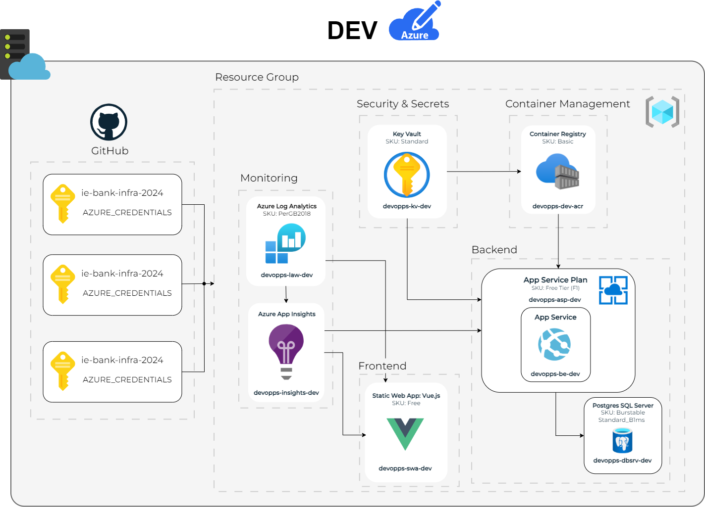
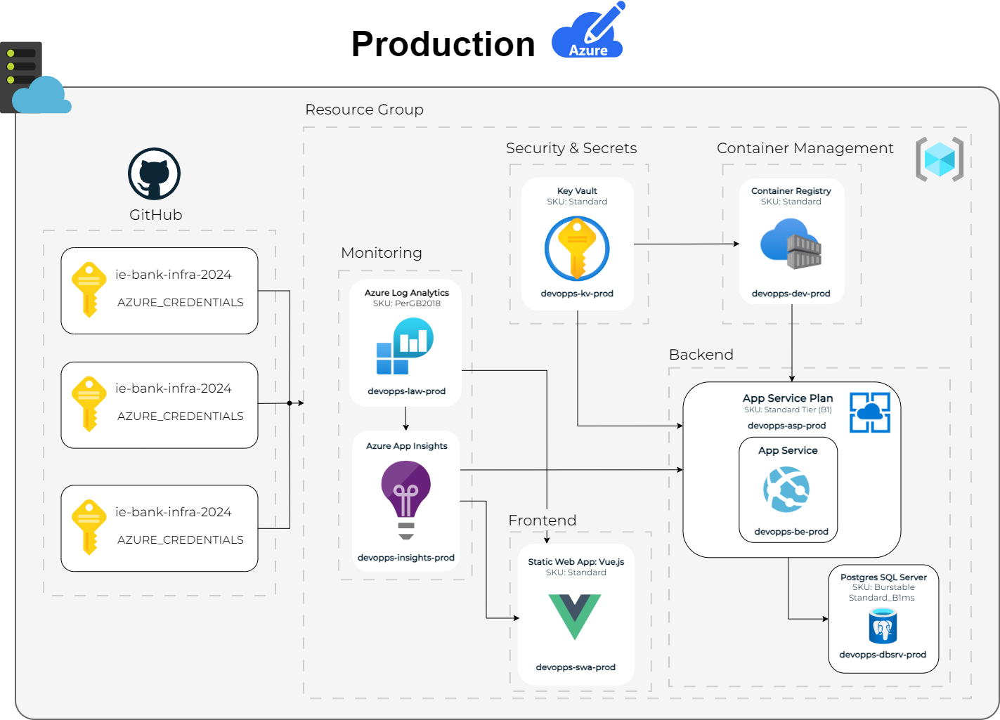

## Infrastructure Development

### Design and Release Strategy Overview
Our three-stage deployment strategy and trunk-based development
ensure efficient and secure code transitions through DEV, UAT, and production. 
In the DEV stage, rapid iterations are enabled through trunk-based development, 
where developers commit directly to the main branch for continuous integration. 
This accelerates feature development and testing using minimal resources. 
The UAT stage mirrors the production environment, 
allowing thorough validation and user acceptance testing. 
Finally, the Prod stage deploys the stable version, optimized for security, 
performance, and scalability. GitHub handles version control, while 
Azure services like Key Vault and Log Analytics ensure security and 
monitoring across all stages, ensuring reliable and smooth software delivery.

### ⁠Infrastructure as Code - Modularization Strategy

#### CI/CD and DevOps Alignment
- Our modularisation strategy integrates seamlessly with a Continuous Integration/Continuous Deployment pipeline, enabling frequent, automated code deployments across all environments.
- By leveraging Container Registry for storing Docker images, Azure DevOps Pipelines or other CI/CD tools can automate builds, tests, and deployments.
-Each module is represented as a reusable Bicep module allowing version control of infrastructure through Github and automated validation in the workflows to ensure they are syntactically correct and free of configuration errors. Additionally, testing of IaC changes before applying them to higher environments and simplified rollbacks and updates with minimal downtime.

#### Scalability: Independent Scaling of Modules
- Modularized components such as Static Web Apps, Azure App Service, and Postgres SQL Server are independently deployed and managed using. Bicep templates, allowing seamless scaling based on workload demands.
- Azure App Service Plan enables horizontal or vertical scaling of backend services without impacting other layers, such as frontend static apps or monitoring systems.
- Container Registry ensures scalable deployment of containerized workloads, allowing new instances to spin up dynamically in response to traffic spikes.
-For databases, Postgres SQL can scale vertically (adding CPU or memory) or horizontally (partitioning data) to meet demand. For future improvements, we will integrate replicas with load balancers like Azure Application Gateway to route queries appropriately and so handle increasing workloads.

#### Security
- Key Vault serves as a centralised and secure repository for managing sensitive credentials, API keys, and certificates. Environment-specific secrets, such as database connection strings or API tokens, are separated for environments. This allows for updates to secrets and key rotations to be managed centrally and be propagated to the respective modules, ensuring consistent security practices.
- Security settings like firewall rules and private endpoints for Postgres SQL Server are managed through Bicep templates, restricting access to trusted networks and services to ensure a robust and scalable security structure.

#### Flexibility: Modular Design for Independent Updates
- The architecture’s modular nature means individual components can be updated or replaced without requiring downtime for the entire system or need of major changes to the rest of the architecture. As well as ease of modificatiins to the system, the probability or error prone changes decreases due to the isolated nature where each module is independently defined, tested, and validated, ensuring that changes made to one component do not inadvertently affect others.
- The architecture is tightly integrated with CI/CD pipelines, ensuring that any updates to a specific module are automatically validated through rigorous testing before deployment. These tests include syntax validation, integration tests, and environment-specific functional testing.

### Hosting Infrastructure - Environment Specification

| Dev | UAT | Prod |
|-|-|-|
||  |  |

| Service            | DEV Configuration | UAT Configuration | Production Configuration |
|-------------------------|-----------------------------------------------------------------------------------------------------------------------|-|-|
| App Service Plan    | Name: `devopps-asp-dev`  SKU: Free tier (F1) Region: Same as production for consistency Scaling: Manual scaling with 1-2 instances |Name: `devopps-asp-uat`  SKU: Free tier (F1) Region: Same as production for consistency Scaling: Manual scaling with 1-2 instances|Name: `devopps-asp-prod`  SKU: Standard (B1) Region: Same as production for consistency Scaling: Manual scaling with 1-2 instances|
| App Service         | Name: `devopps-be-dev` Purpose: Host backend API (Docker containers) Runtime: Node.js/Python/DotNet | Name: `devopps-be-uat`  Purpose: Host backend API (Docker containers) Runtime: Node.js/Python/DotNet |Name: `devopps-be-prod`  Purpose: Host backend API (Docker containers) Runtime: Node.js/Python/DotNet|
| Static Web App      | Name: `devopps-swa-dev`  SKU: Free  Framework: Vue.js Purpose: Serve the frontend code |  Name: `devopps-swa-uat` SKU: Free  Framework: Vue.js Purpose: Serve the frontend code | Name: `devopps-swa-prod` SKU: Standard  Framework: Vue.js Purpose: Serve the frontend code |
| Azure Container Registry (ACR) | Name: `devopps-dev-acr`  SKU: Basic  Purpose: Store backend Docker images | Name: `devopps-dev-uat` SKU: Basic  Purpose: Store backend Docker images | Name: `devopps-dev-prod`  SKU: Standard  Purpose: Store backend Docker images |  
| PostgreSQL Server | Name: `devopps-dbsrv-dev`   Deployment: Single server Tier: Burstable Standard_B1ms  Backup: Disabled | Name: `devopps-dbsrv-uat`  Deployment: Single server Tier: Burstable Standard_B1ms  Backup: Enabled | Name: `devopps-dbsrv-prod`   Deployment: Single server Tier: Burstable Standard_B1ms   Backup: Enabled |
| Key Vault           | Name: `devopps-kv-dev`  SKU: Standard  Purpose: Store secrets and keys securely | Name: `devopps-kv-uat`  SKU: Standard  Purpose: Store secrets and keys securely | Name: `devopps-kv-prod`  SKU: Standard  Purpose: Store secrets and keys securely|
| Azure Log Analytics | Name: `devopps-law-dev`  SKU: PerGB2018  Purpose: Centralized logging | Name: `devopps-law-uat`   SKU: PerGB2018  Purpose: Centralized logging | Name: `devopps-law-prod`  SKU: PerGB2018  Purpose: Centralized logging |
| Azure Application Insights | Name: `devopps-insights-dev`  Purpose: Monitor backend and frontend telemetry metrics |Name: `devopps-insights-uat`  Purpose: Monitor backend and frontend telemetry metrics| Name: `devopps-insights-prod`  Purpose: Monitor backend and frontend telemetry metrics |

### Infrastructure Release Strategy

Our release strategy for the DevOpps Bank Infrastructure is designed to ensure seamless, automated, and secure deployment across multiple environments (Development, UAT, and Production). The following aspects describe our release strategy:

#### Infrastructure as Code (IaC)
The infrastructure is defined and managed using Bicep templates, ensuring consistent deployments and easy scalability.
The main.bicep file orchestrates the deployment of resources, while modular templates located in the modules directory encapsulate reusable configurations for components such as the Key Vault, Azure Container Registry, Database Infrastructure, etc.

#### CI/CD Pipeline
Deployment workflows are automated using GitHub Actions enabling continuous integration and delivery of infrastructure changes. In particular, a workflow called "ie-bank-infra.yml" is ran upon different actions. When pushing to any branch, the build and deploy to development jobs are ran, while deployment to UAT is only done upon a pull request. Finally, deployment to Production is done after a pull request is merged successfully, following all the requirements imposed to do so, like a code review, passing the necessary tests, etc. Finally, deployment to Production is triggered automatically when new commits are pushed to the main branch, following all prerequisites such as a successful build and other defined pipeline steps like code review, passing the necessary tests. This ensures that only validated and approved changes are deployed to the production environment after having DEV and UAT environments tested successfully the pull request.

#### Environment-Specific Configurations
Parameter files located in the parameters directory allow environment-specific customizations for Development, UAT, and Production environments.
This separation ensures that deployments are tailored to the specific requirements of each environment without modifying the core infrastructure templates.

This means that we can scale our environments endlessly by just creating different parameter files with new conditions for new deployment settings.

#### Testing and Validation
The CI/CD pipeline created involves unit testing as well as linting. The workflow has a linting step integrated, which is used to guarantee that the main.bicep file is correctly structured. Also, a separate "kv-test.yml" is executed upon the actions previously mentioned, going through a specific linting test for Key Vault module, a dry run of the Key Vault and testing deployment to DEV environment. The dry run validates the infrastructure configuration and simulates the changes that would be made without actually applying them. The testing deployment deploys an actual testing Key Vault Module based on the configuration of testing parameters. For future implementation, we would need to carry out deployment testing in a specific, isolated resource group which is set up for testing purposes.

It is also important to highlight that the deployment steps (Development and UAT) also serve as tests before deploying to production.
